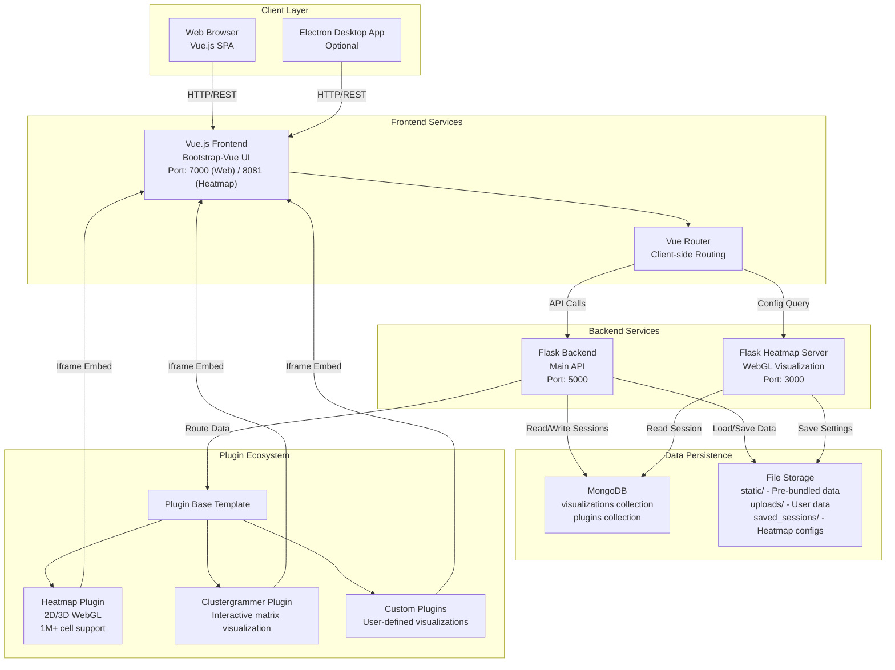
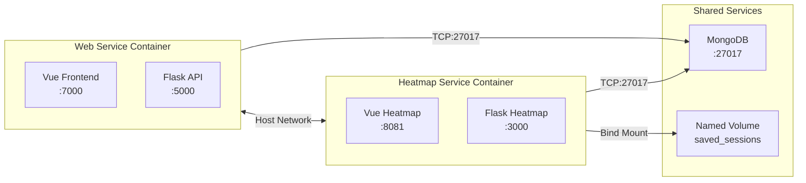
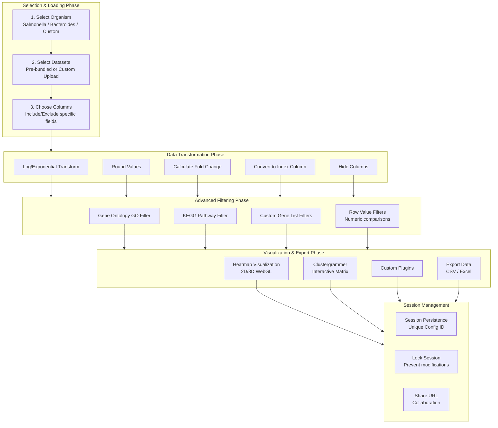
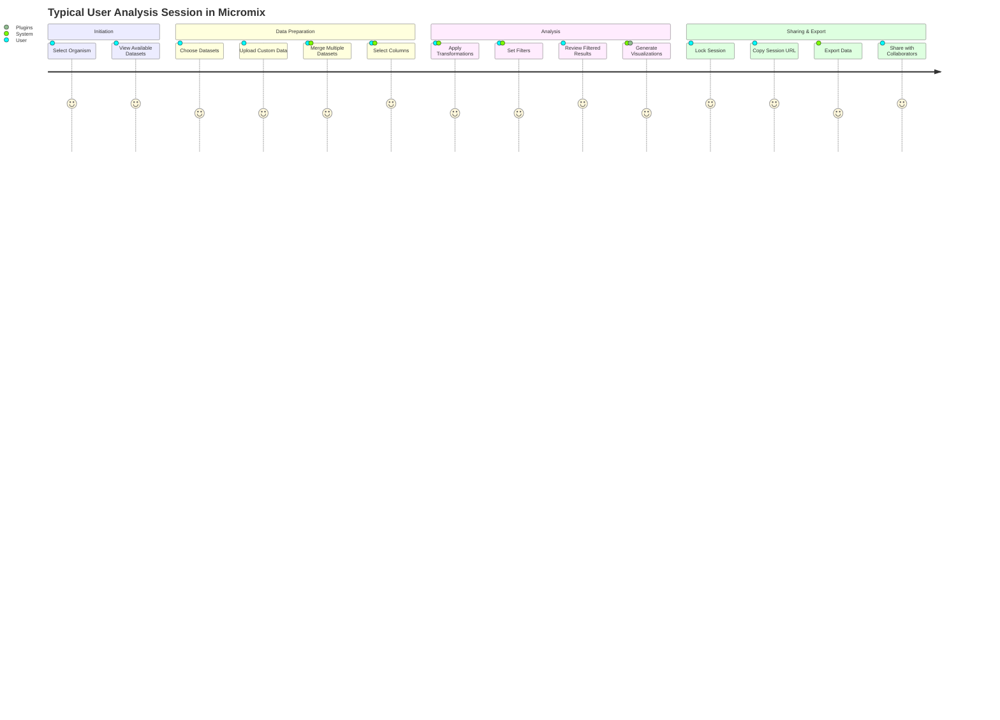
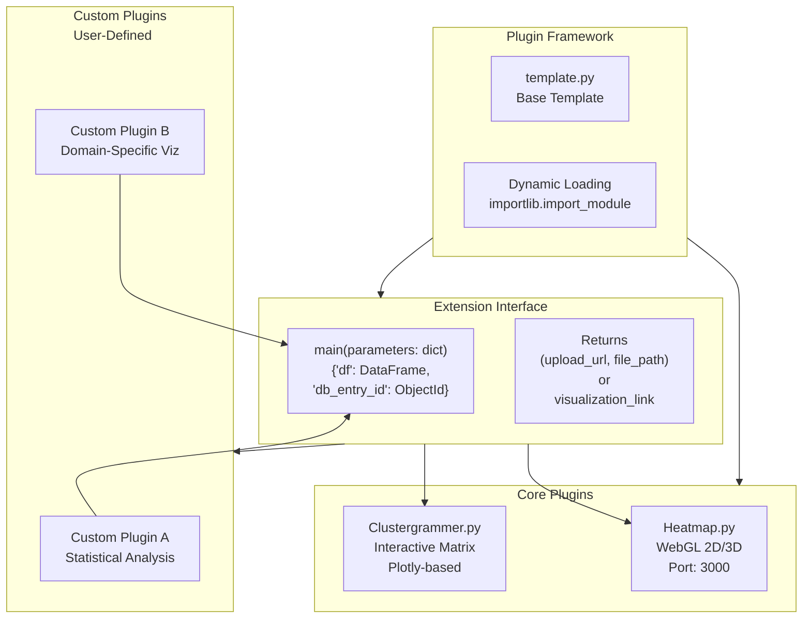
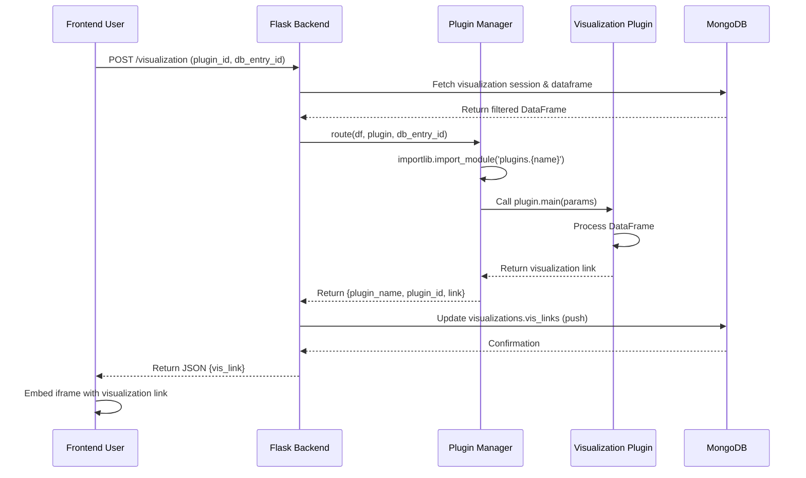
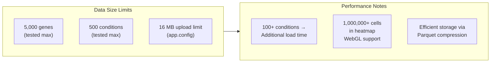

# Micromix - Comprehensive Project Analysis & Overview

**Project Version**: 1.1.0 (Docker deployment)  
**Last Updated**: April 8, 2026  
**Analysis Date**: April 2026

---

## Table of Contents

1. [Executive Summary](#executive-summary)
2. [System Architecture](#system-architecture)
3. [Technical Stack](#technical-stack)
4. [Core Features & User Flows](#core-features--user-flows)
5. [Data Processing Pipeline](#data-processing-pipeline)
6. [Plugin System Architecture](#plugin-system-architecture)
7. [Code Structure & Maintainability](#code-structure--maintainability)
8. [Scalability & Performance Considerations](#scalability--performance-considerations)
9. [Key Insights & Actionable Questions](#key-insights--actionable-questions)
10. [Development Roadmap Recommendations](#development-roadmap-recommendations)

---

## Executive Summary

### Project Purpose
Micromix is a **web-based data visualization and analysis platform** designed specifically for **prokaryotic (bacterial) genomic and transcriptomic data exploration**. It enables researchers to:
- Interactively explore RNA-seq and other functional genomic datasets
- Apply dynamic filtering, transformations, and annotations
- Visualize data through multiple plugin-based rendering engines
- Share reproducible analysis sessions via unique URLs
- Work with pre-bundled bacterial data (Salmonella, Bacteroides) or custom datasets

### Target Users
- **Bioinformaticians** and microbiologists
- **Researchers** studying bacterial gene expression and genomic patterns
- **Collaborative teams** needing shareable analysis sessions
- **Laboratory groups** with custom prokaryotic datasets

### Business Value
- **Accessibility**: No programming required; web-based, browser-accessible interface
- **Reproducibility**: Session persistence via MongoDB with unique shareable URLs
- **Extensibility**: Plugin-based architecture enables custom visualizations
- **Flexibility**: Supports multiple data formats (CSV, TSV, Excel) and organism annotations (GO, KEGG, custom)
- **Scalability**: Cloud-deployable with Docker containerization

---

## System Architecture

### High-Level Architecture Diagram



### Multi-Container Deployment Architecture



---

## Technical Stack

### Frontend Technology Stack

| Component | Technology | Version | Purpose |
|-----------|-----------|---------|---------|
| **Framework** | Vue.js | ^2.6.14 | Progressive SPA framework |
| **UI Library** | Bootstrap Vue | ^2.17.3 | Bootstrap 4.5+ component library |
| **Router** | Vue Router | ^3.1.6 | Client-side routing & navigation |
| **HTTP Client** | Axios | ^1.2.2 | Promise-based HTTP requests |
| **Package Manager** | npm | Latest | JavaScript dependency management |
| **Build Tool** | Vue CLI | ~5.0.0 | Project scaffolding & build |
| **Bundler** | Webpack | (implicit) | Module bundling |
| **CSS Framework** | Bootstrap | ^4.5.2 | CSS & responsive design |
| **Optional Desktop** | Electron | ^22.0.0 | Electron desktop app wrapper |

### Backend Technology Stack

| Component | Technology | Version | Purpose |
|-----------|-----------|---------|---------|
| **Framework** | Flask | Latest | Lightweight Python web framework |
| **Database** | MongoDB | 3.12.1 | NoSQL document storage |
| **Data Processing** | Pandas | Latest | Data manipulation & transformation |
| **Scientific** | NumPy, SciPy, Statsmodels | Latest | Numerical computing |
| **Visualization** | Plotly, Chart-studio | Latest | Interactive visualization generation |
| **CORS** | Flask-CORS | Latest | Cross-origin request handling |
| **Containerization** | Docker | Latest | Container platform |

### Key Dependencies & Libraries

**Data Processing Pipeline:**
- `pandas` - DataFrame operations, CSV/Excel reading
- `numpy` - Numerical operations
- `scipy` - Statistical functions
- `statsmodels` - Advanced statistical modeling

**Visualization:**
- `plotly` - Interactive 2D/3D plots
- `clustergrammer` - Interactive heatmap library

**Infrastructure:**
- `PyMongo 3.12.1` - MongoDB Python driver
- `Flask-CORS` - CORS handling
- `werkzeug` - WSGI utilities & secure file handling

---

## Core Features & User Flows

### Feature Ecosystem



### User Journey Flow



### Critical User Workflows

#### Workflow 1: Pre-bundled Data Analysis

1. **Organism Selection** → User selects "Salmonella" from homepage
2. **Dataset Discovery** → UI displays 6 pre-configured RNA-seq datasets
3. **Selective Loading** → User selects time-series dual-RNA-seq (0-24 hours)
4. **Column Curation** → Optional: remove condition columns not relevant
5. **Transformation** → Apply log transformation to normalize counts
6. **Filtering** → Filter for genes with virulence factors annotation
7. **Visualization** → Generate 2D heatmap with clustering
8. **Session Lock** → Lock and share URL with lab collaborators

#### Workflow 2: Custom Data Integration

1. **Upload** → User uploads custom TSV file (e.g., 5000 genes × 100 conditions)
2. **Format Validation** → System detects delimiter & decimal separator
3. **Merge** → Combine with existing Salmonella data on shared locus tags
4. **Annotation Enrichment** → Automatically load KEGG/GO annotations
5. **Quality Filtering** → Remove genes with <5 counts across all samples
6. **Statistical Transformation** → Calculate log-fold change vs. control
7. **Export** → Download filtered matrix as Excel file for further analysis

---

## Data Processing Pipeline

### Data Flow Architecture

```mermaid
graph LR
    subgraph Input["Input Layer"]
        PreBundled["Pre-bundled Datasets<br/>static/*.tsv/*.csv"]
        UserUpload["User Upload<br/>CSV/TSV/XLSX"]
    end

    subgraph Parsing["Parsing & Validation"]
        Detect["Detect Format<br/>Delimiter, Decimal"]
        Convert["Convert to DataFrame<br/>process_file.convert_to_df"]
        Validate["Validate Schema<br/>Column matching"]
    end

    subgraph Merge["Data Combination"]
        PrepareMerge["Prepare Merge Matrix"]
        JoinOnIndex["Join on Gene ID<br/>Locus Tag matching"]
        CombineMetadata["Combine Metadata"]
    end

    subgraph Transform["Transformation Pipeline"]
        LogScale["Log Scaling<br/>Convert to log10"]
        Normalize["Normalize Values<br/>Round, Scale"]
        FoldChange["Fold Change Calc<br/>Compare to Control"]
        TPM["TPM Calculation<br/>Transcript length + depth"]
    end

    subgraph Filter["Filtering & Selection"]
        GOFilter["GO Term Filter<br/>Gene Ontology"]
        KEGGFilter["KEGG Pathway Filter"]
        CustomList["Custom Gene Lists<br/>Virulence, ncRNA"]
        ValueFilter["Numeric Row Filter<br/>Value comparisons"]
    end

    subgraph Persist["Persistence"]
        Parquet["Serialize to Parquet<br/>Efficient columnar format"]
        MongoDB["Store in MongoDB<br/>visualizations collection"]
        ConfigID["Generate Session ID<br/>UUID for URL"]
    end

    subgraph Visualize["Visualization"]
        PluginRoute["Route to Plugin<br/>visualize.route()"]
        HeatmapRender["Heatmap Plugin<br/>WebGL Rendering"]
        ClusterRender["Clustergrammer<br/>Interactive Matrix"]
    end

    PreBundled --> Detect
    UserUpload --> Detect
    
    Detect --> Convert
    Convert --> Validate
    Validate --> Merge
    
    Merge --> PrepareMerge
    PrepareMerge --> JoinOnIndex
    JoinOnIndex --> CombineMetadata
    CombineMetadata --> Transform
    
    LogScale --> Filter
    Normalize --> Filter
    FoldChange --> Filter
    TPM --> Filter
    
    GOFilter --> Persist
    KEGGFilter --> Persist
    CustomList --> Persist
    ValueFilter --> Persist
    
    Persist --> PluginRoute
    PluginRoute --> HeatmapRender
    PluginRoute --> ClusterRender
```



### Data Transformation Matrix

| Transformation | Input | Operation | Use Case |
|----------------|-------|-----------|----------|
| **Log Scale** | Raw counts | $\log_{10}(x + 1)$ | Normalize skewed distributions |
| **Fold Change** | Two conditions | $\log_2(\text{condition}_1 / \text{condition}_2)$ | Compare gene expression between states |
| **Log Fold Change** | Two conditions | $\log_2(\frac{x_1 + 1}{x_2 + 1})$ | Handle zero values in fold change |
| **TPM** | Counts + lengths | $\frac{\text{counts}}{\text{length}} \times \frac{10^6}{\sum \frac{\text{counts}}{\text{length}}}$ | Normalize for transcript length & library depth |
| **Round Values** | Decimals | Round to N places | Reduce display clutter |
| **Index Conversion** | Gene/Row ID | Set as row index | Enable matrix operations |
| **Column Hide** | Column set | Exclude from display | Focus on relevant conditions |

### Key Data Processing Functions

```python
# process_file.py
convert_to_df(input_file, extension, metadata)
  ↓ Handles: XLSX, CSV, TSV, string input
  
insert_update_entry(entry, collection, metadata)
  ↓ MongoDB insert/update with locked-state protection
  
remove_matrix() / add_matrix()
  ↓ Matrix lifecycle management for multi-panel layouts

# filter_dataframe.py
main(query, df)
  ↓ Step 1: Apply transformations (log, fold change, TPM)
  ↓ Step 2: Apply genelist masks (GO, KEGG, custom)
  ↓ Step 3: Apply value filters (numeric comparisons)

# initial_transformation.py
transform_df(query, df)
  ↓ Dynamic transformation routing based on query type
  ↓ Supports 7+ transformation types

# visualize.py
route(collection, df, plugin, db_entry_id)
  ↓ Dynamic plugin loading via importlib
  ↓ Calls plugin.main({"df": df, "db_entry_id": db_entry_id})
```

---

## Plugin System Architecture

### Plugin Design Pattern



### Plugin Template Structure

```python
# template.py - Blueprint for new plugins
def main(parameters):
    """
    Plugin entry point
    
    Args:
        parameters (dict): {
            'df': pandas.DataFrame - filtered/transformed data
            'db_entry_id': ObjectId - MongoDB document reference
        }
    
    Returns:
        (str, str): (upload_url, file_path) or visualization_link
    """
    file_path = transform_data(parameters["df"])
    upload_url = "" # Define visualization endpoint
    return upload_url, file_path
```

### Plugin Lifecycle



### Built-in Plugins

#### 1. Heatmap Plugin (Dedicated Service)

**Architecture**: Standalone Flask + Vue.js service on port 3000/8081

**Capabilities**:
- 2D & 3D heatmap rendering using WebGL
- Supports 1,000,000+ cells
- Interactive clustering & filtering
- SVG export capability
- User-customizable settings (color scale, legend, zoom)
- Session persistence via file storage (`saved_sessions/{db_entry_id}.json`)

**Key Endpoints**:
- `GET /status` - Health check
- `GET /config` - Fetch data by config ID
- `POST /save-settings` - Persist user heatmap settings
- `GET /get-user-settings/<db_entry_id>` - Retrieve saved configurations

#### 2. Clustergrammer Plugin

**Capabilities**:
- Interactive matrix visualization
- Plotly-based rendering
- Hierarchical clustering display
- Hover-based data inspection

#### 3. Custom Plugin Integration Points

Users can create plugins by:
1. Creating `plugins/MyPlugin.py` in backend
2. Implementing `main(parameters)` function
3. Registering in MongoDB plugins collection
4. Uploading optional custom icon (SVG/PNG)

---

## Code Structure & Maintainability

### Project Directory Tree (Key Files)

```
Micromix/
├── Website/                           # Main web application
│   ├── backend/
│   │   ├── app.py (924 lines)         # Flask API - Core Routes
│   │   ├── process_file.py (430)      # File upload & dataframe processing
│   │   ├── filter_dataframe.py (166)  # Three-step filtering logic
│   │   ├── initial_transformation.py (498) # Data transformations
│   │   ├── visualize.py               # Plugin routing & dynamic loading
│   │   ├── row_filters.py             # Numeric comparison filters
│   │   ├── filter_genelists.py        # GO/KEGG/custom list filtering
│   │   ├── tpm_transform.py           # TPM & transcript calculations
│   │   ├── experimental_features.py   # Beta features & utilities
│   │   ├── plugins/
│   │   │   ├── __init__.py
│   │   │   ├── template.py            # Plugin base template
│   │   │   ├── Heatmap.py             # Heatmap plugin bridge
│   │   │   ├── Clustergrammer.py      # Clustergrammer plugin bridge
│   │   │   └── __pycache__/
│   │   ├── static/                    # Pre-bundled datasets
│   │   │   ├── salmonella_*.tsv       # Salmonella RNA-seq data
│   │   │   ├── b-theta-*.csv          # Bacteroides data
│   │   │   ├── gene_annotations.json  # Gene metadata
│   │   │   └── LICENSE
│   │   ├── uploads/                   # User-uploaded files
│   │   ├── requirements.txt
│   │   ├── Dockerfile
│   │   └── docker-compose.yml
│   │
│   ├── frontend/
│   │   ├── src/
│   │   │   ├── App.vue (751)          # Root component
│   │   │   ├── main.js                # Vue entry point
│   │   │   ├── background.js          # Electron background script
│   │   │   ├── router/
│   │   │   │   └── router.js          # Route definitions
│   │   │   ├── components/            # Vue components
│   │   │   │   ├── toolbar.vue        # Top toolbar (download, lock, help)
│   │   │   │   ├── organism_selection.vue   # Organism picker
│   │   │   │   ├── addDataContainer.vue     # Data loading UI
│   │   │   │   ├── dataframe.vue           # Data table display
│   │   │   │   ├── matrix.vue             # Matrix/panel layout
│   │   │   │   ├── visualization.vue      # Plugin viewer
│   │   │   │   ├── plugins.vue            # Plugin buttons
│   │   │   │   ├── add_plugin.vue         # Plugin management
│   │   │   │   ├── search_query.vue       # Filter UI builder
│   │   │   │   ├── error_alert.vue        # Error messaging
│   │   │   │   └── input_autocomplete.vue # Autocomplete inputs
│   │   │   ├── assets/                # SVG logos & images
│   │   │   ├── views/
│   │   │   │   ├── HomeView.vue
│   │   │   │   └── AboutView.vue
│   │   │   └── plugins/               # Vue plugin extensions
│   │   ├── public/
│   │   │   └── index.html
│   │   ├── Dockerfile
│   │   ├── babel.config.js
│   │   ├── jsconfig.json
│   │   ├── package.json
│   │   ├── vue.config.js
│   │   └── Nginx/
│   │       └── nginx_manual_install.config
│   │
│   └── docker-compose.yml
│
├── Heatmap/                           # Heatmap visualization service
│   ├── backend/
│   │   ├── app.py (140)               # Flask heatmap API
│   │   ├── requirements.txt
│   │   ├── Dockerfile
│   │   └── saved_sessions/            # User heatmap configs
│   │
│   ├── frontend/
│   │   ├── src/                       # Vue heatmap frontend
│   │   ├── public/
│   │   └── Dockerfile
│   │
│   ├── docker-compose.yml
│   └── README.md
│
├── scripts/                           # Data preparation utilities
│   ├── generate_transcriptome.py      # Build transcriptome FASTA
│   ├── parse_eggnog_annotations.R     # Parse eggNOG output
│   ├── MONGO_*.py                     # MongoDB maintenance scripts
│   └── (others)
│
├── images/                            # Documentation images
├── README.md                          # User guide (main)
├── using_micromix.md                  # Usage documentation
├── modifying_micromix.md              # Extensibility guide
├── installing_running_micromix.md     # Installation guide
├── installing_running_plugins.md      # Plugin setup
└── LICENSE
```

### Flask Route Architecture

```python
# app.py - Complete API surface

@app.route('/export', methods=['POST'])
  ↓ export_df() - Export filtered/unfiltered data as CSV or Excel

@app.route('/query', methods=['POST'])
  ↓ search_query() - Apply filters to dataframe

@app.route('/locked', methods=['POST'])
  ↓ lock_session() - Prevent further modifications

@app.route('/active_plugin', methods=['POST'])
  ↓ set_active_plugin() - Set visualization plugin

@app.route('/visualization', methods=['POST'])
  ↓ make_vis_link() - Generate visualization via plugin

@app.route('/plugins', methods=['POST'])
  ↓ add_plugin() - Add new visualization plugin

@app.route('/organisms', methods=['GET'])
  ↓ Retrieve available organisms & datasets

@app.route('/config', methods=['GET', 'POST'])
  ↓ Fetch/create/update visualization configuration

@app.route('/upload', methods=['POST'])
  ↓ Upload & process user data files

@app.route('/merge', methods=['POST'])
  ↓ Merge multiple datasets on common gene IDs
```

### Vue Component Hierarchy

```
App.vue (Root)
├── error_alert.vue (Global error display)
├── (Conditional: initializing screen)
└── (When initialized:)
    ├── toolbar.vue (Top bar: download, lock, help, new doc)
    ├── baseContainer.vue (Main content area)
    │   ├── organism_selection.vue (First step)
    │   ├── addDataContainer.vue (Data loading UI)
    │   │   ├── addDataButton.vue
    │   │   ├── addDataForm.vue
    │   │   ├── addDataTextField.vue
    │   │   └── addDataForm1.vue
    │   │
    │   ├── dataframe.vue (Data table view)
    │   │   └── (Displays current matrix)
    │   │
    │   ├── matrix.vue (Draggable matrix grid)
    │   │   └── (Grid layout manager)
    │   │
    │   ├── search_query.vue (Filter builder)
    │   │   └── input_autocomplete.vue (Autocomplete filters)
    │   │
    │   ├── plugins.vue (Plugin button panel)
    │   │   └── add_plugin.vue (Plugin manager)
    │   │
    │   └── visualization.vue (Iframe container)
    │       └── (Embeds plugin visualizations)
    │
    └── HomeView.vue / AboutView.vue (Routes)
```

### Data Models & Storage

#### MongoDB Collections

**visualizations** (Primary collection):
```javascript
{
  _id: ObjectId,
  organism_id: string,
  
  // Data storage
  dataframe: Binary (parquet),           // Original loaded data
  transformed_dataframe: Binary,         // After transformations
  filtered_dataframe: Binary,            // After filters
  
  // Metadata
  active_matrices: [{id, width, height, x, y, isActive}],
  preview_matrices: [{id, width, height, x, y, isActive}],
  
  // Visualization & plugins
  plugins_id: [ObjectId, ...],          // Available plugins
  active_plugin_id: ObjectId,           // Currently selected
  vis_links: [{plugin_name, plugin_id, link}, ...], // Generated visualizations
  
  // Session management
  locked: boolean,                      // Immutable if true
  query: Array,                         // Last applied filter query
  
  // Timestamps (implicit)
  created_at: Date,
  updated_at: Date
}
```

**plugins**:
```javascript
{
  _id: ObjectId,
  name: string,        // "Heatmap", "Clustergrammer", etc.
  description: string,
  version: string,
  icon: Binary,        // SVG/PNG icon
  server_url: string   // External plugin server
}
```

### Code Quality & Patterns

#### Strengths

1. **Well-Documented Functions**
   - Docstrings follow consistent format (PURPOSE, PARAMETERS, RETURNS, NOTES)
   - Comments explain non-obvious logic
   - Example: `process_file.insert_update_entry()` has 13-line docstring

2. **Modular Decomposition**
   - Each file handles single responsibility (filtering, transformation, visualization)
   - Clear separation between data transformation and UI
   - Plugin system enables extensibility without core modification

3. **Error Handling**
   - Standardized error messages (ERROR_MESSAGES dict)
   - Try-catch blocks with user-friendly error returns
   - Fallback logic for data format issues

#### Areas for Improvement

1. **Import Organization**
   - Some files import inside functions (e.g., `from pymongo import MongoClient` in route handlers)
   - Should consolidate at module level
   - Recommendation: Use lazy imports only for heavy/optional dependencies

2. **Security Concerns**
   - CORS configured to allow all origins: `resources={r"/*":{"origins": "*"}}`
   - Comment in code: "To-Do: Configure CORS to only allow specific requests."
   - File upload validation present but could be stricter
   - Database query comments suggest potential injection risks if user input not properly sanitized

3. **Database Operations**
   - No transaction support visible (critical for multi-step operations)
   - Hardcoded MongoDB host/port for Docker: `'172.17.0.1', 27017`
   - No connection pooling configuration
   - No indexes defined (performance risk at scale)

4. **Error Recovery**
   - Limited rollback mechanism for failed multi-step operations
   - Parquet serialization could fail silently
   - No data validation after deserialization

5. **Code Duplication**
   - DataFrame loading from Parquet repeated multiple times
   - Similar error handling blocks across routes
   - Functions like `remove_matrix()` and `add_matrix()` could be unified

---

## Scalability & Performance Considerations

### Current Capacity & Limits



### Bottleneck Analysis

| Component | Bottleneck | Impact | Mitigation |
|-----------|-----------|--------|-----------|
| **File Upload** | 16MB max (werkzeug limit) | Large datasets rejected | Increase `MAX_CONTENT_LENGTH` or implement chunked upload |
| **DataFrame Processing** | All transformations in-memory | OOM for very large matrices | Implement streaming/chunked processing |
| **MongoDB Serialization** | Parquet ↔ Binary conversion | CPU-intensive at scale | Consider Parquet native storage or columnar DB |
| **Filter Application** | Pandas masking on full DF | O(n*m) complexity | Implement incremental filtering, add database indexes |
| **Plugin Execution** | Synchronous plugin.main() call | Blocks API response | Implement async tasks (Celery/RQ) |
| **Iframe Embedding** | Multiple plugins in one session | Browser rendering load | Lazy-load plugins, virtualize panels |

### Scalability Recommendations

#### Short-term (1-2 months)

1. **Database Optimization**
   ```javascript
   // Add MongoDB indexes
   db.visualizations.createIndex({organism_id: 1, created_at: -1})
   db.visualizations.createIndex({locked: 1})
   db.visualizations.createIndex({plugins_id: 1})
   ```

2. **CORS Security**
   ```python
   # Environment-based CORS config
   CORS(app, resources={
       r"/*": {"origins": os.environ.get('ALLOWED_ORIGINS', 'localhost:8080').split(',')}
   })
   ```

3. **Caching Layer**
   - Add Redis for session caching
   - Cache frequently accessed organism metadata
   - Cache plugin list & icons

4. **File Upload Improvements**
   ```python
   # Implement streaming upload
   app.config['MAX_CONTENT_LENGTH'] = 100 * 1024 * 1024  # 100MB
   # Add chunked upload handler
   ```

#### Medium-term (2-6 months)

1. **Async Processing**
   - Integrate Celery + RabbitMQ for long-running tasks
   - Move filter/transformation to background jobs
   - Implement WebSocket updates for progress tracking

2. **Database Migration**
   - Evaluate TimescaleDB or ClickHouse for columnar queries
   - Consider DuckDB for client-side analytics
   - Implement proper schema with validation

3. **Caching Strategy**
   - Redis cache for organism metadata (~100KB each)
   - ETag-based HTTP caching for static datasets
   - In-memory LRU cache for recently accessed visualizations

4. **API Pagination**
   - Add pagination to large result sets
   - Implement cursor-based pagination for stability

#### Long-term (6+ months)

1. **Microservices Architecture**
   - Separate plugin services (currently couples with main backend)
   - Dedicated data processing service
   - Independent visualization cache service

2. **Cloud Native Design**
   - Kubernetes deployment configuration
   - Horizontal pod autoscaling based on request volume
   - Distributed storage (S3, GCS) instead of local filesystem

3. **Performance Optimization**
   - Query parallelization for large datasets
   - SIMD vector operations via Polars instead of Pandas
   - WebAssembly-based data processing in browser

### Load Testing Recommendations

```python
# Hypothetical load test scenario
Scenario: Concurrent analysis sessions
- 50 concurrent users
- Each user: 3 filter operations + 2 visualizations
- 5,000-gene dataset per session
- Expected response time: <2s per operation

Tools: Apache JMeter, Locust
Metrics to track:
  - API response times (p50, p95, p99)
  - Database query times
  - Memory usage per session
  - Plugin generation times
```

---

## Key Insights & Actionable Questions

### Architectural Insights

#### 1. **Well-Designed Plugin Architecture**
**Finding**: The plugin system demonstrates excellent extensibility design.
- **Evidence**: Template-based pattern, dynamic loading via `importlib`, JSON configuration
- **Implication**: New visualizations can be added without touching core code
- **Question**: Are there documented guidelines for plugin developers? Should we create a plugin marketplace or registry?

#### 2. **Session-Centric Design**
**Finding**: Everything revolves around session persistence via MongoDB config IDs.
- **Evidence**: URL query param `config=667e67...` embeds session state
- **Benefit**: Reproducibility and collaboration-friendly
- **Risk**: No built-in version control or branching (can't "fork" an analysis)
- **Question**: Would version history improve scientific reproducibility? Should users be able to save multiple snapshots?

#### 3. **Data Transformation Pipeline Complexity**
**Finding**: Three-step filter pipeline (transformations → genelists → values) is well-structured but rigid.
- **Evidence**: `filter_dataframe.main()` with hardcoded step sequence
- **Risk**: Custom transformations require code modification
- **Question**: Could users define custom transformation chains via UI? Would a visual workflow builder help?

---

### Security Concerns

1. **CORS Misconfiguration (Critical)**
   - Current: `origins: "*"` (all origins allowed)
   - Risk: CSRF attacks, unauthorized data access
   - Recommendation: Restrict to specific domains
   ```python
   ALLOWED_ORIGINS = os.environ.get('ALLOWED_ORIGINS', 'localhost:8080,localhost:3000')
   CORS(app, resources={r"/*": {"origins": ALLOWED_ORIGINS.split(',')}})
   ```

2. **File Upload Validation (Medium)**
   - Current: Extension whitelist only, no MIME type check
   - Risk: Executable files disguised as data files
   - Recommendation:
   ```python
   import magic  # python-magic
   def validate_file(file_obj):
       mime = magic.from_buffer(file_obj.read(1024), mime=True)
       allowed_mimes = {'text/plain', 'text/csv', 'application/vnd.openxmlformats-officedocument.spreadsheetml.sheet'}
       return mime in allowed_mimes
   ```

3. **MongoDB Injection Risk (Medium)**
   - Current: User queries passed directly to `filter_dataframe`
   - Risk: If query object not properly sanitized
   - Recommendation: Implement query schema validation
   ```python
   from jsonschema import validate
   QUERY_SCHEMA = {...}
   validate(instance=query, schema=QUERY_SCHEMA)
   ```

4. **Session Locking Logic (Low)**
   - Current: Relies on database flag for protection
   - Risk: No cryptographic verification of session ownership
   - Recommendation: Add JWT-based session tokens

---

### Performance Insights

1. **Parquet Serialization Overhead**
   - **Finding**: Every filter operation requires Parquet ↔ Binary ↔ DataFrame conversion
   - **Cost**: CPU-intensive, adds 100-500ms latency per operation
   - **Solution**: 
     - Cache DataFrames in-memory (Redis) for active sessions
     - Use Parquet's lazy-loading capabilities
     - Consider Arrow IPC format for faster serialization

2. **Single-Threaded Plugin Execution**
   - **Finding**: Plugin calls block API responses
   - **Impact**: Slow plugins (e.g., heavy statistical analysis) freeze UI
   - **Solution**: Async task queue (Celery + RabbitMQ)
   ```python
   @app.route('/visualization', methods=['POST'])
   def make_vis_link():
       task = tasks.generate_visualization.delay(plugin, url)
       return {'task_id': task.id}
   ```

3. **Dataset Size Limitations**
   - **Finding**: Tested up to 5,000 genes × 500 conditions
   - **Beyond that**: Expected slowdown or memory issues
   - **Solution**: Implement data sampling/aggregation for large matrices

---

### Feature & UX Insights

#### Strengths

1. **Intuitive Workflow**
   - Sequential UI guides users through logical steps
   - Multiple entry points (pre-bundled data, upload, URL parameter)
   - Clear feedback (loading screen, progress bar)

2. **Collaborative Features**
   - Session URLs shareable with collaborators
   - Lock feature prevents accidental modifications
   - No authentication needed (good for adhoc sharing, risky for sensitive data)

3. **Flexibility in Data Input**
   - Supports multiple file formats (CSV, TSV, Excel)
   - Intelligent delimiter/decimal detection
   - Column selection UI prevents headaches from unused data

#### Improvement Opportunities

1. **Missing Features**
   - No undo/redo capability
   - No draft/saved analysis management (only via URL history)
   - No role-based access control or permission system
   - No audit trail for who modified shared sessions

2. **UI/UX Gaps**
   - Desktop Electron app not fully utilized (electron: ^22.0.0 in package.json but unclear functionality)
   - No dark mode support
   - Filter builder could be more visual (current: form-based)
   - No multi-select capabilities in column chooser

3. **Data Annotation Gaps**
   - Gene annotations (GO, KEGG) appear hardcoded
   - No UI to update/manage annotations
   - No support for custom annotation sources

---

### Business/Product Questions

1. **Target Market Clarity**
   - Current: Built for prokaryotic data specifically
   - Question: Is there demand to support eukaryotic (mammalian) RNA-seq?
   - Impact: Would significantly increase addressable market but requires data format changes

2. **Monetization Strategy**
   - Current: Open-source (check LICENSE for specifics)
   - Question: Enterprise version with authentication, audit logs, data privacy?
   - Opportunity: Premium plugins (advanced statistics, machine learning)

3. **Community Building**
   - Current: GitHub repository with documentation
   - Question: Are users contributing plugins? Any plugin repository?
   - Recommendation: Formalize plugin submission process, create developer community

4. **Competitive Positioning**
   - Similar tools: GenePattern, Galaxy, Cytoscape, R Shiny apps
   - Micromix's advantages: Lightweight, browser-based, session persistence
   - Question: What's the unique value proposition for new users?

---

## Development Roadmap Recommendations

### Phase 1: Stabilization & Security (Months 1-2)

**Priority**: High - Foundation for scale

- [ ] **Security Hardening**
  - [ ] Fix CORS configuration (environment-based)
  - [ ] Implement file MIME type validation
  - [ ] Add SQL/MongoDB injection prevention
  - [ ] Generate security policy documentation

- [ ] **Testing Infrastructure**
  - [ ] Add unit tests for filter/transform logic (pytest)
  - [ ] Integration tests for API routes (pytest-flask)
  - [ ] End-to-end tests for key workflows (Selenium)
  - [ ] Target: 70% code coverage

- [ ] **Code Refactoring**
  - [ ] Move top-level imports to module start
  - [ ] Consolidate repeated error handling
  - [ ] Extract common patterns (DataFrame loading, etc.)
  - [ ] Add type hints (Python 3.7+ compatible)

- [ ] **Documentation**
  - [ ] API documentation (Swagger/OpenAPI)
  - [ ] Plugin developer guide with examples
  - [ ] Architecture decision records (ADRs)

### Phase 2: Performance & Scalability (Months 3-4)

**Priority**: High - Support growth

- [ ] **Database Optimization**
  - [ ] Define and create MongoDB indexes
  - [ ] Implement connection pooling
  - [ ] Add query profiling/monitoring
  - [ ] Migrate from hardcoded 172.17.0.1 to service discovery

- [ ] **Caching Layer**
  - [ ] Deploy Redis instance
  - [ ] Cache organism metadata
  - [ ] Cache plugin list & icons
  - [ ] Implement session timeout policy

- [ ] **Upload Improvements**
  - [ ] Chunked file upload support
  - [ ] Increase max upload size to 100MB
  - [ ] Add progress tracking (server-sent events)
  - [ ] Implement file format auto-detection (libmagic)

- [ ] **API Enhancement**
  - [ ] Add pagination to list endpoints
  - [ ] Implement request rate limiting
  - [ ] Add request/response logging
  - [ ] Health check & metrics endpoint

### Phase 3: Features & UX (Months 5-6)

**Priority**: Medium - User delight

- [ ] **Analysis Management**
  - [ ] Save multiple analysis versions
  - [ ] Undo/redo functionality
  - [ ] Analysis comparison view
  - [ ] Export analysis as reproducible report

- [ ] **Visualization Enhancements**
  - [ ] Plugin preview/thumbnail generation
  - [ ] Lazy-load plugins (don't initialize until used)
  - [ ] Plugin marketplace/registry
  - [ ] Star/rate plugins

- [ ] **Data Management**
  - [ ] Organism/dataset CRUD UI
  - [ ] Annotation management interface
  - [ ] Data provenance tracking
  - [ ] Batch upload for multiple files

- [ ] **UI/UX Improvements**
  - [ ] Dark mode support
  - [ ] Responsive design refinement
  - [ ] Filter builder visual redesign
  - [ ] Help tutorials/tooltips

### Phase 4: Enterprise & Advanced (Months 7-9)

**Priority**: Medium - Unlock new use cases

- [ ] **Authentication & Authorization**
  - [ ] OAuth2 integration (Google, GitHub, institutional)
  - [ ] SAML for enterprise SSO
  - [ ] Role-based access control (RBAC)
  - [ ] Audit logging

- [ ] **Advanced Analytics**
  - [ ] Differential expression analysis plugin
  - [ ] Pathway enrichment plugin
  - [ ] Clustering/dimensionality reduction (PCA, t-SNE)
  - [ ] Statistical test suite

- [ ] **Cloud Deployment**
  - [ ] Kubernetes manifest & Helm chart
  - [ ] AWS/GCP deployment templates
  - [ ] CI/CD pipeline (GitHub Actions/GitLab CI)
  - [ ] Infrastructure-as-Code (Terraform)

- [ ] **Data Privacy**
  - [ ] Encryption at rest (MongoDB)
  - [ ] Encryption in transit (TLS 1.3)
  - [ ] Data retention policies
  - [ ] GDPR/CCPA compliance

### Phase 5: Ecosystem (Months 10+)

**Priority**: Low - Future-oriented

- [ ] **Plugin Ecosystem**
  - [ ] Official plugin registry/marketplace
  - [ ] Plugin version management
  - [ ] Plugin dependency resolution
  - [ ] Monetization platform (premium plugins)

- [ ] **Integration Partnerships**
  - [ ] ENA/NCBI data import
  - [ ] Bioregistry integration
  - [ ] Workflow engine integration (Nextflow, WDL)
  - [ ] Export to Galaxy/GenePattern

- [ ] **Research Tools**
  - [ ] Session citation generation (DOI/BibTeX)
  - [ ] Analysis report generation (PDF)
  - [ ] Data archival to biorepositories
  - [ ] Open Science Framework integration

- [ ] **Community**
  - [ ] User forum/Slack channel
  - [ ] Monthly webinars & tutorials
  - [ ] Plugin developer program
  - [ ] Research publications featuring Micromix

---

## Implementation Metrics & KPIs

### Development Metrics

```
Velocity: Story points per 2-week sprint
Code Coverage: Target 70% → 85% → 90%
Technical Debt: Measured via static analysis (SonarQube)
Issue Resolution Time: Avg days from report to fix
```

### Product Metrics

```
User Adoption: Monthly active users (MAUs)
Session Duration: Avg analysis session length (min)
Feature Adoption: % users using each plugin
Data Volume: Total GB of data analyzed monthly
Retention: % users returning after 1 month
NPS: Net Promoter Score (quarterly surveys)
```

### Performance Metrics

```
API Response Time: p50, p95, p99 latencies (target: <2s per operation)
Plugin Execution Time: By plugin type
Data Processing Throughput: Genes/sec processed
Database Query Time: Avg MongoDB query latency
Error Rate: % failed API requests (target: <0.5%)
Availability: % uptime (target: 99.5%)
```

---

## Summary & Recommendations

### Strengths Summary

✅ **Well-architected plugin system** - Extensible, documented, modular  
✅ **Thoughtful data pipeline** - Clear separation of concerns across 7 specialized modules  
✅ **Session-centric design** - Enables reproducibility and collaboration  
✅ **Comprehensive documentation** - User guides, installation guides, modification guides  
✅ **Multi-format data support** - CSV, TSV, Excel handling with auto-detection  
✅ **Rich filtering capabilities** - GO, KEGG, custom lists, numeric comparisons  

### Critical Issues Summary

🔴 **CORS misconfiguration** - Allows requests from any origin (must fix immediately)  
🔴 **Security validation gaps** - File uploads, MongoDB queries need hardening  
🟡 **Scalability bottlenecks** - Parquet serialization, synchronous plugin execution  
🟡 **No test suite** - Increases regression risk, limits refactoring confidence  
🟡 **Missing audit trail** - Can't track who modified shared sessions  

### Strategic Recommendations

1. **Immediate (This Sprint)**
   - Fix CORS security issue (5 min fix, high impact)
   - Add pytest unit test scaffolding (establish testing culture)
   - Document API contract (Swagger/OpenAPI)

2. **Short-term (Next 3 Months)**
   - Implement database indexes and monitoring
   - Add Redis caching layer
   - Refactor imports and error handling
   - Establish CI/CD pipeline

3. **Medium-term (6-12 Months)**
   - Build async task processing (Celery)
   - Implement user authentication & RBAC
   - Create plugin marketplace
   - Expand to eukaryotic data support

4. **Long-term (12+ Months)**
   - Kubernetes-native deployment
   - Enterprise compliance (GDPR, CCPA, HIPAA)
   - Advanced analytics plugin suite
   - Research community engagement

---

## Appendices

### A. Technology Choices Rationale

| Choice | Rationale | Alternatives Considered |
|--------|-----------|------------------------|
| **Flask** | Lightweight, Pythonic, good for research tools | Django (overkill), FastAPI (newer, less mature in 2021) |
| **MongoDB** | Flexible schema for heterogeneous data | PostgreSQL (schema would be rigid), DynamoDB (vendor lock-in) |
| **Vue.js** | Progressive framework, gentle learning curve | React (more complex), Svelte (smaller ecosystem in 2021) |
| **Parquet** | Efficient columnar storage, compression | HDF5 (less compatible), CSV (large file sizes) |
| **Docker** | Reproducible deployment, isolation | VirtualBox (slower), Singularity (less web-friendly) |

### B. Potential Issues & Mitigations

```
Issue: Large dataset (10,000 genes × 1,000 conditions) causes memory exhaustion
Mitigation: Implement streaming dataframe operations, consider DuckDB

Issue: Multiple users modifying same session creates race conditions
Mitigation: Add MongoDB transactions (requires MongoDB 4.0+), implement optimistic locking

Issue: Plugin crashes bring down whole backend
Mitigation: Run plugins in isolated processes/containers, add timeout handling

Issue: No backup strategy for user data
Mitigation: Implement MongoDB backup schedule, cloud storage integration

Issue: Heatmap renders slowly with >100 conditions
Mitigation: Implement level-of-detail rendering, add WebGL optimization
```

### C. Future Technology Considerations

- **Apache Arrow / Polars** - Faster data manipulation than Pandas
- **Dask** - Distributed dataframe processing for large datasets
- **Streamlit** - Alternative lighter-weight framework (but less control)
- **FastAPI** - Performance upgrade to Flask for I/O-heavy operations
- **PostgreSQL + pgvector** - Similarity search for gene expression patterns
- **Rust/WebAssembly** - Performance-critical data processing in browser
- **GraphQL** - Alternative to REST for flexible data queries

### D. Relevant Literature & References

- **Session State Management**: Roy Fielding's REST dissertation (Ch. 5 on statelessness)
- **Plugin Architecture**: *Building Microservices* by Sam Newman
- **Data Processing**: *High Performance Python* by Gorelick & Ozsvald
- **API Design**: *RESTful Web Services* by Richardson & Ruby
- **Bioinformatics Frameworks**: Galaxy (https://usegalaxy.org), GenePattern

---

**Document prepared by**: Comprehensive Code Analysis Engine  
**Version**: 1.0  
**Status**: Final  
**Distribution**: Public
