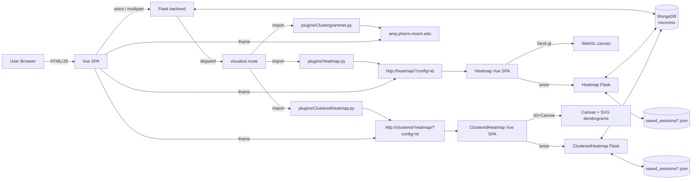

# Micromix — Codebase Exploration Report

> Exploration authored for a developer new to this repository. The goal is to explain how the system works end-to-end — architecture, data flow, storage, transformations, API contracts, and rendering — so a new contributor can ramp up without needing to re-read the whole codebase first.
>
> Scope: read-only exploration of `Micromix-1/`. No source files were modified. This report is the only artifact produced.

---

## 1. High-Level Overview

### What this project does
**Micromix** is a web-based platform for exploring and visualizing biological expression data (primarily prokaryotic RNA-seq / TraDIS / TPM datasets for *Salmonella* and *Bacteroides thetaiotaomicron*). A user can:

1. Pick an **organism** (Salmonella / Bacteroides / generic "default").
2. **Upload datasets** from one of three sources: (a) bundled catalog files in `Website/backend/static/`, (b) a tab-separated paste, (c) a local `.csv` / `.tsv` / `.txt` / `.xlsx` file.
3. Multiple uploaded matrices are **merged into a single working dataframe**.
4. Apply a chain of **transformations and filters** through a block-based query builder (round, log, fold-change, TPM, hide column, replace values, filter by KEGG/GO/PUL/CPS/etc.).
5. Render the result via one of three **visualization plugins**:
   - **Heatmap** — an in-house Deck.gl (WebGL) 2D/3D heatmap living in its own stack under `Heatmap/`.
   - **Clustergrammer** — an external third-party clustered-heatmap service at `amp.pharm.mssm.edu`.
   - **ClusteredHeatmap** — an in-house Canvas+SVG clustered heatmap with collapsible row dendrograms, living in its own stack under `ClusteredHeatmap/`. Shares the same Mongo `visualizations` collection as the Deck.gl Heatmap (see §2 and `clustered_dendrogram_heatmap_instructions.md`).
6. **Lock** a session so that a shareable URL (e.g. `?config=<MongoID>`) always returns the same view.
7. **Export** the current dataframe as CSV or multi-sheet XLSX.

### Main technologies

| Layer | Technology |
|---|---|
| Main backend | Python 3 + Flask + Flask-CORS + pandas + pyarrow (parquet) |
| Main frontend | Vue 2.6 + BootstrapVue + axios + vue-typeahead-bootstrap |
| Heatmap backend | Python 3 + Flask + pymongo + pandas |
| Heatmap frontend | Vue 2.6 + @deck.gl (core/layers) + chroma-js + CryptoJS |
| ClusteredHeatmap backend | Python 3 + Flask + pymongo + pandas (clone of Heatmap backend) |
| ClusteredHeatmap frontend | Vue 2.6 + d3 v7 + BootstrapVue + axios (+ CryptoJS for settings hash) |
| Persistence | MongoDB (`micromix` DB) + filesystem JSON (heatmap user settings) |
| Data exchange | Parquet (in DB) + JSON (API boundary) |
| Deployment | Docker Compose (one compose file per stack) |

### How the project is organised

```
Micromix-1/
├── README.md                         # Top-level user guide table-of-contents
├── OVERVIEW.md                       # Long-form project overview
├── installing_running_*.md           # Install/run guides
├── modifying_micromix.md             # Developer guide for extending
├── using_micromix.md                 # End-user guide
├── micromix_codebase_exploration.md  # Prior exploration (P0-P3 audit)
├── implementation_progress.md        # Log of P0 fixes already applied
├── images/                           # Documentation screenshots
├── scripts/                          # Standalone Python/R utilities (DB maintenance, annotation parsing)
├── Website/                          # MAIN APP (Flask + Vue 2)
│   ├── backend/
│   ├── frontend/
│   ├── plugins.json                  # Declarative plugin registry consumed by frontend
│   └── docker-compose.yml
├── Heatmap/                          # HEATMAP PLUGIN (Flask + Vue 2 + Deck.gl)
│   ├── backend/
│   ├── frontend/
│   └── docker-compose.yml
└── ClusteredHeatmap/                 # CLUSTERED HEATMAP PLUGIN (Flask + Vue 2 + d3)
    ├── backend/                      # clone of Heatmap/backend; ports 3001
    ├── frontend/                     # Canvas + SVG dendrograms; ports 8082
    └── docker-compose.yml
```

### Main entry points

| Entry | File | Role |
|---|---|---|
| Main API server | `Website/backend/app.py` | Flask app, all HTTP routes |
| Main SPA shell | `Website/frontend/src/App.vue` | Root Vue component, session orchestration |
| Main SPA bootstrap | `Website/frontend/src/main.js` | Creates Vue instance, imports `./router.js` (Vue 2 router) |
| Heatmap API server | `Heatmap/backend/app.py` | Flask app for heatmap plugin |
| Heatmap SPA shell | `Heatmap/frontend/src/App.vue` | Mounts `deckglCanvas.vue` |
| Heatmap renderer | `Heatmap/frontend/src/components/deckglCanvas.vue` | All fetch + layer-building + gradient logic (1437 lines) |
| ClusteredHeatmap API server | `ClusteredHeatmap/backend/app.py` | Flask app for clustered-heatmap plugin. Same `/status`, `/config`, `/save-settings`, `/get-user-settings/<id>` surface as the Heatmap backend. |
| ClusteredHeatmap SPA shell | `ClusteredHeatmap/frontend/src/App.vue` | Mounts `clusteredHeatmapCanvas.vue` + `loadingOverlay.vue`. |
| ClusteredHeatmap renderer | `ClusteredHeatmap/frontend/src/components/clusteredHeatmapCanvas.vue` | Fetches `/config`, builds internal matrix via `lib/matrix.js`, clusters via `lib/hclust.js`, renders heatmap body (Canvas) + row/column dendrograms (SVG via `dendrogramSVG.vue`), handles collapse/expand and aggregation. |

---

## 2. Architecture Map

### Service topology

```
┌───────────────────────────────────────────────────────────────────┐
│                          Browser / User                           │
└──────────┬────────────────┬────────────────────────┬──────────────┘
           │ http           │ http (iframe src)      │ http (iframe src)
           ▼                ▼                        ▼
 ┌────────────────────┐  ┌────────────────────────┐  ┌──────────────────────────────┐
 │ Micromix Vue       │  │ Heatmap Vue frontend   │  │ ClusteredHeatmap Vue frontend│
 │ frontend           │  │ (port 8081 → :80)      │  │ (port 8082 → :80)            │
 │ (port 7000 → :80)  │  │                        │  │                              │
 └──────────┬─────────┘  └───────────┬────────────┘  └───────────┬──────────────────┘
            │ axios                  │ axios                     │ axios
            ▼                        ▼                           ▼
 ┌────────────────────┐  ┌────────────────────────┐  ┌──────────────────────────────┐
 │ Micromix Flask     │  │ Heatmap Flask backend  │  │ ClusteredHeatmap Flask       │
 │ backend            │  │ (port 3000)            │  │ backend (port 3001)          │
 │ (port 5000)        │  │                        │  │                              │
 └──────────┬─────────┘  └───────────┬────────────┘  └───────────┬──────────────────┘
            │ pymongo                │ pymongo +                 │ pymongo +
            │                        │ FS (saved_sessions/)      │ FS (saved_sessions/)
            └─────────────┬──────────┴───────────────────────────┘
                          ▼
              ┌──────────────────────┐
              │   MongoDB (micromix) │
              │   host 172.17.0.1    │
              │   collections:       │
              │    - visualizations  │
              │    - plugins         │
              └──────────────────────┘
```

MongoDB host/port are now env-driven (`MONGODB_HOST` / `MONGODB_PORT`) in both `Website/backend/app.py:158-160` and `Heatmap/backend/app.py:24-26`, with the historical default `172.17.0.1:27017`.

### Website/backend — modules and responsibilities

| File | Role |
|---|---|
| `app.py` | All Flask routes; MongoDB connection; session CRUD; export to CSV/XLSX; wraps `process_file`, `filter_dataframe`, `visualize`. |
| `process_file.py` | Matrix ingest → DataFrame → parquet → MongoDB; outer-joins all active matrices into one `transformed_dataframe`. |
| `filter_dataframe.py` | Top-level 3-step query pipeline (transform → genelist filter → row filter). Orchestrates next three modules. |
| `initial_transformation.py` | Implements all "Transform Data" block types: `replace`, `round`, `hide`, `logarithmic`, `fold_change`, `convert_to_index`, `transcript_length`, `calculate_tpm`. Also `setup_query_parameters` and `filter_for` used by both transform and genelist paths. |
| `filter_genelists.py` | Apply masks for "expression" and "annotation_code" queries; combines masks with AND/OR via `apply_logics`. |
| `row_filters.py` | Final row-level value/string filters (the "Filter values" block). |
| `tpm_transform.py` | Two numeric transforms: `count_transcript_length`, `calculate_tpm`. |
| `experimental_features.py` | `adjust_numeric_dtype(df)` — downcasts int/uint dtypes to reduce parquet size. |
| `visualize.py` | Tiny dispatcher: `importlib.import_module("plugins.<plugin_name>")` then calls `plugin.main({df, db_entry_id})`. |
| `plugins/Heatmap.py` | Returns a URL into the Heatmap frontend with `?config=<db_id>`. |
| `plugins/Clustergrammer.py` | Posts the dataframe as TSV to the external Clustergrammer matrix-upload endpoint and returns the response URL. |
| `plugins/template.py` | Example/skeleton plugin. |
| `static/` | Bundled reference datasets (`*.tsv`, `*.csv`) + `gene_annotations.json` (97k lines; locus-tag-keyed dictionary with GO/KEGG/PUL/CPS/CTn/promoter/RegPrecise/CRP annotation arrays). |
| `uploads/` | Target folder for served uploads; contains a stray `output_matrix.txt`. |

`transform_dataframe` is imported defensively (`try/except ImportError`) inside `process_file.add_matrix` (`process_file.py:189-194`). The actual `transform_dataframe.py` file is not present in the repo, so the matrix-level transformation hook silently degrades to a warning.

### Website/frontend — components

| File | Role |
|---|---|
| `src/main.js` | Bootstraps Vue, registers BootstrapVue + vue-typeahead-bootstrap, imports `./router.js`. |
| `src/router.js` | Vue 2 router. Maps `/` → `visualization.vue`, `/hallo/ja` → `matrix.vue` (latter looks like dev leftover). |
| `src/router/index.js` | **Unused Vue 3 `createRouter` artifact** — conflicts with Vue 2 dependencies, replaced by `router.js`. Flagged as legacy in `implementation_progress.md`. |
| `src/App.vue` | Root. Owns `config` session object, loads `/config`, merges in `plugins.json`, renders organism picker / plugin picker / query UI / table / visualization iframe / upload & plugin modals. |
| `src/components/toolbar.vue` | Top-right toolbar: lock session, export CSV/XLSX, copy URL, new session, help popovers. |
| `src/components/addDataButton.vue`, `addDataForm.vue`, `addDataForm1.vue`, `addDataTextField.vue`, `addDataContainer.vue` | Upload UI. `addDataForm.vue` is the active one (bound in `App.vue:152`). Supports tabs: Datasets / Paste Text / Upload File / URL. |
| `src/components/matrix.vue` | SVG grid showing existing matrices with add/replace/remove semantics. Emits `matrix_activated`, `transformation_selected`, `delete`. |
| `src/components/organism_selection.vue` | Per-organism card for the homepage (before a config exists). |
| `src/components/plugins.vue` | Plugin card (Heatmap / Clustergrammer). Triggers `/visualization` generation. |
| `src/components/add_plugin.vue` | Form to upload a new plugin record (name + URL + icon). |
| `src/components/search_query.vue` | Block-based query builder (851 lines). Reads `../assets/organisms/<org>/filters.json` and `pathways.json`. Builds `this.query`, emits to `/query`. |
| `src/components/input_autocomplete.vue` | Typeahead for selecting GO/KEGG terms from loaded pathways. |
| `src/components/dataframe.vue` | BootstrapVue `b-table` display + filtered/unfiltered toggle + pagination. |
| `src/components/visualization.vue` | `<iframe>` that loads the plugin URL from `active_vis_link`. |
| `src/components/error_alert.vue` | Error toasts at top. |
| `src/components/baseContainer.vue` | Generic card wrapper (used sparingly). |
| `src/views/HomeView.vue`, `AboutView.vue` | Present but **unused** because `main.js` imports `router.js` (not `router/index.js`). |
| `src/background.js` | Electron entrypoint (project was also packaged as Electron desktop app via `vue-cli-plugin-electron-builder`). |

### Website/frontend — static JSON configuration

| Path | Role |
|---|---|
| `Website/plugins.json` | Declarative plugin registry merged into `config` on every `/config` response. Three entries: Clustergrammer (`_id=5f984ac1b478a2c8653ed827`), Heatmap (`_id=khds8fohoduskfi7syf99`), and ClusteredHeatmap (`_id=ch_01hxz9cbl8z3k0000000000000`). Note: only the Clustergrammer value is a real ObjectId — the other two are arbitrary strings by design, and any downstream code must not `ObjectId()`-cast these IDs. |
| `src/assets/json/organisms.json` | Metadata for each supported organism: `id`, `path`, list of applicable dataset keys. |
| `src/assets/json/datasets.json` | Per-dataset catalog entries: filename, separator, decimal char, available columns, pre-selected columns. Consumed by `addDataForm.vue`. |
| `src/assets/organisms/<org>/filters.json` | **Critical**: the complete schema of query blocks for that organism. Split into `templates` (row filters), `functional` (KEGG/GO/PUL/etc.), `presets` (genelists), `transformations`, `other.logical_operators`. |
| `src/assets/organisms/<org>/pathways.json` | Available KEGG/GO/PUL/CPS/Ctn/promoter/RegPrecise/CRP annotations. |
| `src/assets/organisms/<org>/icon.svg` | Organism icon. |

### Heatmap/backend

| File | Role |
|---|---|
| `app.py` | Four routes: `/status`, `/config` (POST; fetches a session's dataframe from Mongo and returns as JSON records), `/save-settings` (persists UI settings for a session to `saved_sessions/<dbId>.json`), `/get-user-settings/<dbId>` (reads that file back). |
| `saved_sessions/` | Filesystem store for per-session heatmap UI settings (gradients, camera, lighting, etc.). One `.json` per MongoID. Docker volume-mounted (`saved_sessions:/app/saved_sessions`). |

### Heatmap/frontend

| File | Role |
|---|---|
| `main.js` | Bootstrap + mount. Uses `./router/index.js` which is **Vue 2** (not the broken Vue 3 artifact in the website). |
| `App.vue` | Mounts `deckglCanvas` + `loadingOverlay`. |
| `components/deckglCanvas.vue` | **The engine room.** 1437 lines. Fetches data, transforms JSON → Deck.gl layers, builds per-subtable gradients/legend/text, persists & reloads user settings. |
| `components/mainMenu.vue` | Left icon bar: Home, Settings, Save User Settings, Export Image. Contains `saveUserSettings()` which builds the settings payload and POSTs to `/save-settings`. |
| `components/settingsMenu.vue` | The expandable settings panel (gradient presets, cell size, 3D elevation, lighting, material). |
| `components/cameraMenu.vue` | Top-right camera switcher (Top / Side / Front / 3D). |
| `components/exportMenu.vue` | PNG / SVG export of the current deck canvas. |
| `components/loadingOverlay.vue` | Initial loading spinner. |
| `assets/settingsTemplate.json` | Initial shape + defaults for the whole settings tree used by `settingsMenu`. |

### ClusteredHeatmap/backend

| File | Role |
|---|---|
| `app.py` | Clone of `Heatmap/backend/app.py`. Same four routes (`/status`, `/config`, `/save-settings`, `/get-user-settings/<dbEntryId>`). Listens on port 3001. Reads the same `micromix.visualizations` collection — there is no dedicated database for this plugin. |
| `saved_sessions/` | Docker-volume-mounted filesystem store for per-session clustered-heatmap user settings. Not populated in v1 (the frontend does not POST to `/save-settings` yet). |
| `requirements.txt` / `Dockerfile` | Pinned-version copies of the Heatmap equivalents (Flask 1.1.2, pymongo 3.11, pandas, pyarrow). Container `EXPOSE`s 3001 and `CMD ["flask", "run", "--host=0.0.0.0", "--port=3001"]`. |

### ClusteredHeatmap/frontend

| File | Role |
|---|---|
| `main.js` | Bootstrap + mount. Uses `./router/index.js` (Vue 2 router, empty route table — routing is query-string-based via `?config=<id>`). |
| `App.vue` | Mounts `clusteredHeatmapCanvas` + `loadingOverlay`. |
| `components/clusteredHeatmapCanvas.vue` | **The engine room.** ~800 lines. Fetches `/config`, calls `lib/matrix.js` to build the internal matrix, `lib/hclust.js` to build row/column dendrograms, renders the heatmap body on a `<canvas>` and the dendrograms via `dendrogramSVG.vue`. Tooltips, legend, row cap (500), column cap (200), and auto-collapse-top-level behaviour all live here. |
| `components/dendrogramSVG.vue` | Pure SVG dendrogram renderer. One O(N) `buildLayout` pass per reactive update; emits `branch-clicked(nodeId)` for row-cluster expand/collapse. |
| `components/settingsPanel.vue` | Left drawer: clustering toggle, distance metric, value mode (numeric/log/z-score/presence), missing-value policy, aggregation (mean/median/sum/presence %), color scale preset, auto-diverging flag, collapse-all / expand-all / reset. |
| `components/loadingOverlay.vue` | Copy of the Deck.gl Heatmap overlay (same CSS animation, title changed). |
| `lib/matrix.js` | Converts `/config` JSON records into the internal `HeatmapMatrix` (rowIds, colIds, values, imputed, stats). Handles the `(<matrix title>) <column>` detection, imputation (`nan`/`zero`/`mean`), value-mode transforms (`numeric`/`log`/`presence`/`zscore`), deduplicated row IDs, optional row-meta labels. |
| `lib/distances.js` | `euclidean`, `correlationDistance`, `jaccard`, and `pairwise(vectors, metric)`. |
| `lib/hclust.js` | Agglomerative average-linkage clustering (UPGMA). Returns a DendroNode with cached `leaves`. Works on the plain 2-D `Array` distance matrix (not a `Float64Array`) so rows can be extended safely as merged clusters are appended. |
| `lib/aggregate.js` | `aggregateCluster(matrix, memberIds, axis, aggregation)` — mean/median/sum/presence_pct over the *transformed* values in `matrix.values`. Does not re-apply the value-mode transform. |
| `lib/treeOrder.js` | `dfsLeaves`, `allInternalNodeIds`, `topLevelNodeIds`, and `visualRows(dendro, collapsedSet)`. |
| `Nginx/nginx_manual_install.config` | Reverse-proxy template for bare-metal deployment; Docker compose uses the container's own Nginx. |

### Scripts (repo root)

| File | Role |
|---|---|
| `scripts/generate_transcriptome.py` | Standalone CLI. GFF + FASTA → transcriptome FASTA. Not wired into the web app. |
| `scripts/parse_eggnog_annotations.R` | R script to process eggNOG output into gene annotations (feeds into `gene_annotations.json`). |
| `scripts/MONGO_count_records_between_dates.py`, `MONGO_remove_records_between_dates.py`, `MONGO_look_for_locked.py` | DB maintenance utilities — count/remove sessions, audit locked ones. |

### Inter-module dependency graph (simplified)

```
                          ┌──────────────────────────────────────────┐
                          │           Vue App.vue                    │
                          │  (loads config, selects plugin, renders  │
                          │   search_query + dataframe + iframe)     │
                          └──────────┬───────────────────────────────┘
                                     │ axios (JSON + multipart)
                                     ▼
                 ┌────────────────────────────────────────────────┐
                 │        Website/backend/app.py (Flask)          │
                 │                                                │
                 │  /config   /upload   /query   /visualization   │
                 │  /export   /locked   /active_plugin  /plugins  │
                 │  /matrix/<id>        /uploads/<filename>       │
                 └──┬──────────────┬──────────────┬───────────────┘
                    │              │              │
        process_file│  filter_dataframe          visualize
                    │              │              │
                    ▼              ▼              ▼
       convert_to_df            Step1: initial_transformation.transform_df
       rename_df_columns        Step2: filter_genelists.filter_genelists
       merge_db_entry                 (reads gene_annotations.json)
       make_active_matrix       Step3: row_filters.row_filters
       df_to_parquet
                                                   plugins.<Name>.main(...)
                                                   │
                                    ┌──────────────┴─────────────┐
                                    │                            │
                              Heatmap.py                  Clustergrammer.py
                              (returns URL)               (uploads TSV to external)
```

---

## 3. Data Flow

### 3.1 Session bootstrap

```
URL ?config=<MongoID>
   │
App.vue:created → load_config()
   │  POST /config { url: "<MongoID>" | "undefined" }
   ▼
Website/backend/app.py:respond_config()
   │  if url != "undefined":
   │    db_entry = visualizations.find_one({_id: ObjectId(url)})
   │    if bytes(transformed_dataframe):
   │       read_parquet(...).to_json(orient="records")  # ← serialization switch
   │    try: same for filtered_dataframe
   │  else: copy.deepcopy(DB_ENTRY_MOCKUP)
   ▼
App.vue:
   config = { ...res.data.db_entry, ...pluginsConfig }  # merge server entry with local plugins.json
   parse_dataframe_json()  # JSON.parse strings back into JS arrays
   active_plugin_id = config.active_plugin_id
   active_vis_link  = get_active_vis_link(active_plugin_id)
```

Key subtlety: the **same field holds different types** at different lifecycle stages. In MongoDB, `transformed_dataframe` is parquet bytes (BSON Binary). Over the wire to the browser, it's a JSON **string**. In memory on the frontend, it's an **array** of row objects (after `parse_dataframe_json`). This duality must be kept in mind anywhere the field is touched.

### 3.2 Data upload & matrix merge

```
User submits addDataForm.vue
   │
   │ POST /upload (multipart)
   │   form: { title, x, y, matrix_id, db_entry_id, transformation,
   │           formatting:{file,text}, source:{file|text|database|url},
   │           database_columns, local_active_organism_id }
   │   file: <binary>
   ▼
app.py:add_matrix()
   ├─ upload_file(request, ALLOWED_EXTENSIONS_MATRIX, metadata)
   │    ├─ 'file' in request.files → return file, ext
   │    ├─ metadata.source.text    → return text, "string"
   │    └─ metadata.source.database → read "static/<filename>"
   ▼
process_file.add_matrix(input_file, metadata, extension, db, PRE_CONFIGURED_PLUGINS)
   │
   ├─ convert_to_df(input_file, extension, metadata)
   │     ├─ read_excel / read_csv (with csv_seperator, decimal_character, usecols)
   │     ├─ str.replace('.', '_') on column names
   │     └─ experimental_features.adjust_numeric_dtype(df)
   │
   ├─ If metadata.db_entry_id != '' and a transformation is requested:
   │     try import transform_dataframe  (module missing in repo → warning)
   │     if successful: df = transform_dataframe.main(type, metadata, df_old, df)
   │
   ├─ rename_df_columns(df, title)
   │     numeric columns → "(<title>) <colname>"
   │     ← KEY CONVENTION used everywhere downstream
   │
   ├─ make_active_matrix(metadata, df, active_matrices, df_to_parquet(df))
   │     positions the matrix in the 2D grid, resizes, calls correct_matrice_positions
   │
   ├─ merge_db_entry(db_entry, sum(active_matrices, []))
   │     df_merged = outer-merge over all matrices' parquet payloads
   │     db_entry.transformed_dataframe = df_to_parquet(df_merged)
   │
   ├─ db_entry.preview_matrices = make_preview_matrices(...)
   │  db_entry.vis_links = []
   │  db_entry.filtered_dataframe = []
   │  db_entry.active_plugin_id = ''
   │  db_entry.active_organism_id = metadata.local_active_organism_id
   │
   └─ if new session: insert_one()  else: insert_update_entry() (respects locked flag)
```

`merge_db_entry` rebuilds the entire merged dataframe on every add/remove — this is acknowledged as O(N·M) and "NOTE: Performance" in the source.

### 3.3 Query pipeline (transform + filter)

```
search_query.vue composes `query` array-of-arrays of blocks, submitting via
   POST /query {query, url}
▼
app.py:search_query()
   df = read_parquet(db_entry.transformed_dataframe)
   filtered_df = filter_dataframe.main(query, df)
   mongo_update: $set {filtered_dataframe: parquet, vis_links: [], query}
   upload_db_entry(db_entry, mongo_update, url)  ← creates new doc if session is locked
▼
filter_dataframe.main(query, df):

   STEP 1 — Transformations
   ──────────────────────────
   transformations_to_check = {
     "Round Values", "Change Values", "Convert to index column", "Hide Column",
     "Calculate fold change", "Convert to log", "Calculate log fold change"
   }
   if any block.name ∈ transformations_to_check:
       transformed_df = initial_transformation.transform_df(query, df)
       df2 = transformed_df
   else:
       df2 = df

   STEP 2 — Genelist / annotation filter
   ─────────────────────────────────────
   filtered_df = filter_genelists.filter_genelists(query, df2)
     For each block of type "filter":
       mask = filter_for(block.forms, block.properties, df2, op, area)
       masks.append(mask)
     For each block of type "logic":
       logics.append(operator)  # "and" / "or"
     If more than one mask: apply_logics(masks, logics)
     filtered_df = df2[final_mask].drop_duplicates()

   STEP 3 — Row value filter ("Filter values" block)
   ─────────────────────────────────────────────────
   row_filters_list = [b for b in query if b.name == "Filter values"]
   row_filtered_df = row_filters.row_filters(query, filtered_df, row_filters_list)
     For each row filter: apply numeric/string comparison on target columns,
     AND-combine if "all columns", OR-combine otherwise.

   return row_filtered_df
```

**Back-end uses literal UI labels** (`"Round Values"`, `"Filter values"`, `"= equal to"`, etc.) as dispatch keys. Renaming a user-facing label in `filters.json` will silently break the backend.

### 3.4 Visualization dispatch

```
App.vue:select_plugin(plugin)
   │  Checks existing vis_links; if none for this plugin → generate_vis_link(plugin)
   │  Also enforces ≤200 rows for Clustergrammer (_id "5f984ac1b478a2c8653ed827")
   │  POST /active_plugin {active_plugin_id, url}  ← persists selection
   ▼
POST /visualization {plugin, url}
   ▼
app.py:make_vis_link()
   if len(db_entry.filtered_dataframe) > 0:
       df = read_parquet(db_entry.filtered_dataframe)
   else:
       df = read_parquet(db_entry.transformed_dataframe)
   vis_link = visualize.route(db.plugins, df, plugin, ObjectId(url))
   db.visualizations.update_one({_id}, $push: {vis_links: vis_link})
   return {vis_link}
   ▼
visualize.route(collection, df, plugin, db_entry_id):
   plugin_module = importlib.import_module(f"plugins.{plugin['name']}")
   return {
     plugin_name, plugin_id,
     link: plugin_module.main({df, db_entry_id})
   }
```

For Heatmap, the link is simply `http://127.0.0.1:8081/?config=<db_entry_id>` (or `$HEATMAP_FRONTEND_URL`). For Clustergrammer, the TSV is POSTed to an external service and the returned URL is stored. For ClusteredHeatmap, the link is `http://127.0.0.1:8082/?config=<db_entry_id>` (or `$CLUSTERED_HEATMAP_FRONTEND_URL`) — analogous to Heatmap. `visualize.route` resolves the plugin module dynamically via `importlib.import_module(f"plugins.{plugin['name']}")`, so adding new plugins requires no dispatcher change.

### 3.5 Heatmap data & render pipeline

```
Heatmap URL ?config=<MongoID>
   │
deckglCanvas.vue:mounted
   │ new Deck({canvas, viewState, getTooltip, ...})
   │ createLegendGradientLayer()
   │ fetchData(`${backendUrl}/config`)
   ▼
POST /config (Heatmap)
   ▼
Heatmap/backend/app.py:respond_config()
   prefer filtered_dataframe, fallback transformed_dataframe
   → JSON string via to_json(orient="records")
   ▼
deckglCanvas.vue:fetchData → processJsonData(json)
   │ For each column:
   │   - If starts with "(" and contains ") " → detect subtable prefix
   │     (reset per-subtable min/max, bump x coordinate by 1.4 to create gap)
   │   - Else, normal column, bump x by 1.0
   │   - Scale x: coordinate / 140
   │   - Emit columnTextLayerData entry (header)
   │
   │ For each row × column cell:
   │   - If first column: emit rowTextLayerData entry (row header)
   │   - Else if Number.isFinite(value): emit gridCellLayerData entry
   │     {COLUMN, ROW, VALUE, TITLE: <subtable prefix>, COORDINATES,
   │      ORIENTATION: -1 if negative (VALUE flipped positive)}
   │   - Else: emit textCellLayerData entry
   │
   │ Track overall lowestValue / highestValue, and subTables[prefix]
   │
   ▼ returns [gridCellLayerData, textCellLayerData, rowTextLayerData,
              columnTextLayerData, highestValue, lowestValue]
   ▼
createSubTableGradientForms()   ← pushes per-table gradient controls into settingsTemplate
configureNegativeValues()       ← overrides getPosition/getFillColor if data has negatives
updateLegendText()              ← TextLayer entries above each gradient
updateDeckLayers()              ← deck.setProps({ layers: [...] })

───────────────────────────────────────
User setting changes:
  mainMenu → settings-changed event → deckglCanvas.updateSettings
  → updateLegendGradientLayer() rebuilds PolygonLayer + LineLayer + TextLayer per table

User "Save" button:
  mainMenu.saveUserSettings() constructs userSettings
  → POST /save-settings { dbEntryId, settings } to Heatmap backend
  → persisted to saved_sessions/<dbEntryId>.json

Page load:
  fetchData → generateHash(rawData) (SHA256 of stable-stringified data)
  → loadUserSettings() → GET /get-user-settings/<dbEntryId>
  → if response.hash === this.hashValue: apply saved settings (cache invalidated if data changed)
```

---

## 4. Data Connections and Relationships

### 4.1 Shared data structures

**Session document (MongoDB `visualizations` collection)** — template in `app.py:50` (`DB_ENTRY_MOCKUP`):

| Field | Type | Populated by | Consumed by |
|---|---|---|---|
| `_id` | ObjectId | Mongo insert | Everywhere (used in URL `?config=...`) |
| `active_matrices` | list-of-lists of matrix objects | `process_file.make_active_matrix` | `matrix.vue`, `remove_matrix`, `merge_db_entry` |
| `preview_matrices` | list of matrix objects (with border slots) | `process_file.make_preview_matrices` | `addDataForm.vue`, `matrix.vue` |
| `transformed_dataframe` | parquet bytes \| JSON string \| list | `merge_db_entry`, `add_matrix`, `/config` serializer | Query, export, vis, Heatmap |
| `filtered_dataframe` | parquet bytes \| JSON string \| empty list | `/query` | Export, vis, Heatmap |
| `vis_links` | list of `{plugin_name, plugin_id, link}` | `/visualization` | `App.vue:get_active_vis_link` |
| `plugins_id` | list of strings | Session creation | Historically used for plugin lookup (now masked by local `plugins.json`) |
| `active_plugin_id` | string | `/active_plugin` | `App.vue`, UI highlight |
| `active_organism_id` | string | `add_matrix`, organism picker | `search_query.vue` (to load correct filters/pathways) |
| `locked` | bool | `/locked` | `upload_db_entry`, `insert_update_entry`, toolbar |
| `query` | list-of-lists of query blocks | `/query` | `search_query.vue:convert_server_query_blocks` on reload |

**Matrix object** — `process_file.make_single_matrix` (`process_file.py:425`):

```js
{
  id: <uuid hex>,
  title: <user-specified string>,
  x: <grid x, 1 = border>, y: <grid y, 1 = border>,
  width: <cells>, height: <cells>,
  isActive: <bool>,
  dataframe: <parquet BSON Binary>
}
```

**Query block** (as built by the frontend and consumed by the backend):

```js
{
  name:       "Round Values" | "Filter values" | "GO Terms" | ... ,
  id:         "_xxx" (guid),
  logic:      "and" | "or" | false,
  inline_coordinates: [blockArrayIndex, positionInArray] | false,
  properties: { type: "round"|"replace"|"hide"|"filter"|"logic"|"fold_change"|
                       "logarithmic"|"convert_to_index"|"transcript_length"|"calculate_tpm",
                query:      "expression"|"annotation_code"|"column"|"integer",
                code_type?: "go_id"|"kegg_pathway_id"|... (for annotations) },
  forms:      { filter_area?, filter_value?, logical_operator?, target_column?,
                target_table?, target_value?, log_value?, round_value?,
                filter_annotation?, start_column?, end_column?, counts_column? }
}
```

### 4.2 Vue props/events (main app)

```
App.vue
 ├── toolbar        : props(locked, backend_url)
 ├── addDataButton  : emits plugin_clicked
 ├── organism_selection : props(organism, local_active_organism_id)
 ├── plugins        : props(active_plugin, active_vis_link, title, desc, image_url, id)
 ├── search_query   : props(df_categories, server_queries, backend_url, table_titles,
 │                          active_organism)
 │                    emits dataframe_filtered, error_occured
 ├── visualization  : props(vis_link)
 ├── dataframe      : props(dataframe, dataframe_filtered, update_is_filter)
 └── modal:addDataForm
      ├── props(matrices, plugins, df_categories, backend_url,
      │         local_active_organism_id, active_organism)
      ├── emits dataframe_change, error_occured, close
      └── matrix  : props(matrices, rect_width, rect_height, gap, df_categories)
                    emits delete, matrix_activated, transformation_selected
```

`App.vue` is effectively the single store — everything cascades from its `config` reactive object.

### 4.3 API request/response shapes (summary)

| Endpoint | Method | Request (FormData) | Response |
|---|---|---|---|
| `/config` | GET/POST | `url` (ObjectId JSON-string or `"undefined"`) | `{db_entry: {...}}` or `{error_type, error_message}` |
| `/upload` | POST | `form` (JSON metadata) + `file` (optional) | `{db_entry_id: {$oid}}` or error |
| `/matrix/<matrix_id>` | POST | `form` (JSON metadata) | `{db_entry_id: {$oid}}` |
| `/query` | POST | `query` (JSON), `url` (JSON) | `{db_entry_id: {$oid}}` |
| `/visualization` | POST | `plugin` (JSON), `url` (JSON) | `{vis_link: {plugin_name, plugin_id, link}}` |
| `/active_plugin` | POST | `active_plugin_id` (JSON), `url` (JSON) | `"success"` text |
| `/locked` | POST | `url` (JSON) | `"success"` text |
| `/export` | POST | `export_form` (JSON, {file_type, csv_seperator}), `url` (JSON) | binary `.xlsx` or `.csv` Response |
| `/plugins` | POST | `form` (JSON metadata) + icon file | `{db_entry_id: {$oid}}` |
| `/uploads/<filename>` | GET | — | file |

**Heatmap backend** — 4 endpoints:

| Endpoint | Method | Request | Response |
|---|---|---|---|
| `/status` | GET | — | `"alive"` |
| `/config` | GET/POST | `url` (JSON ObjectId-string) | JSON array of records (from filtered or transformed dataframe) |
| `/save-settings` | POST | `{ dbEntryId, settings }` JSON body | `{message}` / `{error,details}` |
| `/get-user-settings/<dbEntryId>` | GET | — | settings JSON file contents |

**ClusteredHeatmap backend** — identical surface to the Heatmap backend. The same four endpoints, same request/response shapes, and the same `micromix.visualizations` collection. The two backends are interchangeable from the database's point of view; each plugin's frontend decides what to do with the JSON records it fetches.

### 4.4 File formats used for I/O

| Direction | Format | Notes |
|---|---|---|
| In-DB storage | **Parquet** (BSON Binary) | `process_file.df_to_parquet` and `app.py:df_to_parquet` (duplicated). Selected for columnar compression. |
| API to Website frontend | JSON string (`orient='records'`) | Parsed by `App.vue:parse_dataframe_json` into a JS array. |
| API to Heatmap frontend | JSON records | Built directly in `Heatmap/backend/app.py:respond_config`. |
| API to ClusteredHeatmap frontend | JSON records | Built directly in `ClusteredHeatmap/backend/app.py:respond_config` (same code as the Heatmap backend). |
| Input file uploads | CSV / TSV / TXT / XLSX | Parsed by `pandas.read_csv` / `read_excel` with user-specified separator & decimal character. |
| Bundled static data | TSV / CSV in `Website/backend/static/` | Catalog entries in `datasets.json` name them. |
| Annotations | `Website/backend/static/gene_annotations.json` | Single flat dictionary keyed by locus tag. Loaded **fresh on every filter request** in `initial_transformation.filter_for` and `filter_genelists.filter_for`. |
| Exported data | CSV (single sheet — filtered if present else unfiltered) / XLSX (filtered + unfiltered sheets) | `app.py:df_to_csv`, `df_to_excel`. |
| Heatmap user settings | JSON file per-session on disk | `Heatmap/backend/saved_sessions/<MongoID>.json`. Mounted as Docker volume. |

### 4.5 Column-prefix convention (informal schema)

After an upload, every numeric column is renamed to `(<matrix title>) <original column>`. This prefix convention is relied upon by:

- `Clustergrammer.prepare_df` — identifies value vs category columns (`plugins/Clustergrammer.py:29`).
- `initial_transformation.setup_query_parameters` — builds `filter_area` for a `target_table` block (`initial_transformation.py:410`).
- `deckglCanvas.processJsonData` — detects subtable boundaries for per-table gradients and legends (`deckglCanvas.vue:1174`).
- `initial_transformation.transform_df` (`convert_to_index`) — strips prefix when converting columns to strings (`initial_transformation.py:287`).

No schema validation enforces this — it is purely a string convention.

### 4.6 Where the same data is reused

- `transformed_dataframe` is re-read (and re-serialized) by every one of: `/config`, `/query`, `/visualization`, `/export`, and Heatmap `/config`.
- `gene_annotations.json` is opened from disk inside both `initial_transformation.filter_for` and `filter_genelists.filter_for` — i.e. per request, per filter block, potentially multiple times (97k-line JSON).
- `plugins.json` is statically imported at frontend build time (`App.vue:202`) **and** shallow-merged over the DB entry on every `/config` response.

---

## 5. Visualization / Output Logic

### 5.1 In-app data table — `dataframe.vue`

- Props: `dataframe` (unfiltered array), `dataframe_filtered` (array), `update_is_filter` (bool).
- Renders via `<b-table>` with sortable headers generated from `items[0]`'s keys (`create_table_headers`, `dataframe.vue:139`).
- Toggling "Show filtered" swaps `items` between the two arrays and refreshes pagination.
- Expects `items[0]` to exist (empty filtered results will break header generation).

### 5.2 Heatmap — `deckglCanvas.vue`

Expects: a JSON array of uniform row objects, first column is the index/locus-tag. Columns that don't use the `(<title>) col` pattern still render as a single implicit subtable.

**Layer stack** built by `updateDeckLayers`:

| Layer | Purpose |
|---|---|
| `GridCellLayer` | Each cell is a rectangular column at `[row/140, scaledCol]`; elevation = `VALUE * elevationScale * ORIENTATION`; fill from `colorGradientDict[TITLE](VALUE)`. |
| `TextLayer` (textCellLayer) | Non-numeric cells are drawn as text instead of a colored bar. |
| `TextLayer` (rowTextLayer) | Row headers (first column values) to the left of the grid. |
| `TextLayer` (columnTextLayer) | Column headers rotated 180°, displayed above each column. |
| `PolygonLayer`[] (rectangleGradientLayers) | One gradient strip per subtable on the RHS of the heatmap. |
| `LineLayer`[] | Tick marks (min, mid, max) adjacent to each gradient strip. |
| `TextLayer`[] | Numeric labels on each tick, plus a name label above each gradient. |

**Color logic**:

- `colorGradientDict` holds one chroma-js scale per subtable title.
- Users can either use one shared preset or enable `individualGradients` (auto-enabled if >1 subtable).
- Domains per scale are `[min, mid, max]` computed by `calculateGradientDomain` using order-of-magnitude rounding for the midpoint.
- Negative-containing data triggers `configureNegativeValues`, which rewires `getPosition`/`getFillColor` to honor the cached `ORIENTATION` flag (since elevation can't be negative in GridCellLayer, sign is encoded out-of-band).

**User interaction**:

- Camera menu sets `currentViewState` and toggles `extruded`/`elevationScale` for 3D.
- Settings menu edits `settings.gradient[tableName]` domains → triggers `updateLegendGradientLayer` and re-paints cells.
- Save button serializes `settings` + camera + computed hash and POSTs to `/save-settings`.
- On reload, hash of current data is recomputed — if it matches the saved hash, settings are re-applied (`loadUserSettings`).

**Limitations** (observed):
- All JSON→layer transformation runs in the browser (could be 10k+ rows).
- `createSubTableGradientForms` **mutates** `settingsTemplate` by pushing per-subtable form controls (`deckglCanvas.vue:1324`) — HMR / re-mounting duplicates them.
- Text sizes are hand-tuned constants (e.g. `getSize: 1575 / (String(VALUE).length + 2.5)`); not responsive to zoom consistently.

### 5.3 Clustergrammer

Data is TSV-uploaded to the external Ma'ayan Lab endpoint. The response URL is embedded in the same iframe used by the Heatmap. Fails if the external service is down or if >200 rows (explicit guard in `App.vue:362`).

### 5.4 Export

- `df_to_excel`: writes multi-sheet workbook with "Source Data" + "Filtered Data" sheets via xlsxwriter.
- `df_to_csv`: writes a **single** dataframe — filtered if non-empty, otherwise unfiltered. The previous crash mode (`KeyError` when filtered missing) was fixed per `implementation_progress.md`.

---

## 6. Important Workflows

### 6.1 App startup

```mermaid
sequenceDiagram
  participant Browser
  participant Vue as App.vue
  participant API as Flask /config
  participant Mongo

  Browser->>Vue: navigate ?config=<id> (or none)
  Vue->>Vue: created() → load_config()
  Vue->>API: POST /config {url}
  alt url defined
    API->>Mongo: find_one({_id: ObjectId(url)})
    Mongo-->>API: db_entry (parquet bytes)
    API->>API: parquet → to_json(orient='records') for transformed & filtered
  else url undefined
    API->>API: copy.deepcopy(DB_ENTRY_MOCKUP)
  end
  API-->>Vue: { db_entry }
  Vue->>Vue: merge with local plugins.json
  Vue->>Vue: parse_dataframe_json (strings → arrays)
  Vue->>Vue: initializing=false; show UI
```

### 6.2 Upload → merge → render workflow

1. User picks organism → `config.active_organism_id` set locally.
2. Opens `addDataForm`, picks a source tab (Datasets/Paste/File), sets title + matrix slot.
3. `POST /upload` with multipart payload.
4. Backend parses file → DataFrame → parquet → MongoDB.
5. `merge_db_entry` rebuilds `transformed_dataframe`.
6. Response returns `db_entry_id`.
7. Frontend navigates to `?config=<db_entry_id>` → triggers `/config` reload → renders the table.

### 6.3 Query workflow

1. `search_query.vue:created` loads `filters.json` + `pathways.json` for current organism.
2. For any existing `server_queries` (from a re-opened session), `convert_server_query_blocks` rehydrates the block UI by deep-copying block templates and assigning `selected` values.
3. User clicks "Add…" dropdowns → `add_query_block` pushes into `this.query`.
4. On submit, `restructure_query` flattens `this.query` into the backend contract (name, properties, id, logic, inline_coordinates, forms).
5. `POST /query` → backend 3-step pipeline runs.
6. `/query` response → `dataframe_filtered` event → `App.vue:redirect_to_config` → reload config.

### 6.4 Lock & share workflow

1. User clicks lock in `toolbar.vue` → `POST /locked`.
2. Backend sets `locked=True` on the doc.
3. Subsequent modification attempts in `upload_db_entry`/`insert_update_entry` will **insert a new doc** rather than overwrite — effectively forking the session.
4. Sharing the URL now points at an immutable snapshot; the recipient's edits create a new session.

### 6.5 Heatmap save-and-restore

1. User tweaks gradient / camera.
2. Clicks "Save User Settings" → `POST /save-settings` → file written to `saved_sessions/<id>.json` with a SHA256 of the data as invalidation hash.
3. Next visitor: `fetchData` → `generateHash(rawData)` → `loadUserSettings`. If hashes match, UI state is re-applied. If data was re-filtered since save, saved settings are silently ignored.

---

## 7. Potential Weak Points

### 7.1 Correctness / fragility

1. **Duplicated/legacy router artifacts**.
   - `Website/frontend/src/main.js` imports `./router.js` (Vue 2) — correct and used.
   - `Website/frontend/src/router/index.js` uses Vue 3's `createRouter` — **dead code** that will break if somehow imported by tooling. `HomeView.vue`/`AboutView.vue` are referenced only by this dead router.
   - Flagged as follow-up in `implementation_progress.md`.

2. **Triple-valued session fields**. `transformed_dataframe`/`filtered_dataframe` flip between parquet-bytes, JSON string, JS array, and sometimes an empty list. Every consumer must handle all three shapes. Easy to regress.

3. **Backend dispatch keyed on UI labels**. `filter_dataframe.main` checks `block.name in {"Round Values","Filter values",...}` and `initial_transformation.setup_query_parameters` looks for literals like `"any column"`, `"all columns"`, `"= equal to"`. Renaming a label in `filters.json` silently skips the corresponding backend branch.

4. **Column-prefix convention is structural**. Subtable detection in the heatmap, Clustergrammer, and fold-change all parse `(title) col`. A title containing `) ` would confuse the parser.

5. **Gene annotations loaded per-block, per-request**. `static/gene_annotations.json` is 97k lines; it is opened and parsed inside every call to `filter_for` for annotation-type queries. No caching.

6. **`dataframe.vue:create_table_headers` assumes `items[0]` exists**. Empty filtered result would crash header building.

7. **`add_plugin` writes icon to `/Users/`** — `app.py:582` hardcodes `/Users/` as the save directory. Works on a developer laptop, fails in a container or under a different OS.

8. **`UPLOAD_FOLDER = '/static'`** (`app.py:144`) is an absolute root; yet database-backed source files are read via relative `"static/<filename>"` (`app.py:803`). Inconsistent addressing.

9. **`merge_db_entry` performance**. Full outer-join over all matrices' parquet payloads on every add/remove. Comment in source already notes it. Scales poorly as matrix count grows.

10. **`createSubTableGradientForms` mutation**. Pushes into `settingsTemplate.basicSettings.settings[i].inputs` array by reference (`deckglCanvas.vue:1324`). During HMR or navigation, duplicates accumulate.

11. **Two `df_to_parquet` implementations** (`app.py:896`, `process_file.py:270`). Identical bodies. Drift risk.

12. **Unbounded CORS + debug flags**. `app.py:141` `origins: "*"`, `DEBUG=True`, `FLASK_DEBUG=1` all forced on; same story in the Heatmap backend. Not production-safe defaults.

13. **Locked-session semantics**. `insert_update_entry` creates a new session on edit, but `locked` is reset to `False` on the new record — correct for forking, but the "new" session loses the lock state without an explicit indicator to the user.

14. **Clustergrammer external dependency**. Hardcoded URL `https://amp.pharm.mssm.edu/clustergrammer/matrix_upload/`. No timeout, retry, or fallback. Any network hiccup breaks the plugin.

15. **`respond_config` for new sessions**. Returns `DB_ENTRY_MOCKUP` which has `transformed_dataframe: []`. Downstream code then checks `len(db_entry['transformed_dataframe']) > 0` — works, but couples "empty" detection to a specific falsy container type.

### 7.2 Maintainability issues

- `Website/backend/app.py` is ~930 lines of mixed routing + helpers + serialization.
- `Heatmap/frontend/src/components/deckglCanvas.vue` is 1437 lines and mixes fetch, data transformation, layer construction, legend drawing, settings persistence.
- `Website/frontend/src/App.vue` is 750 lines mixing orchestration, UI, and CSS.
- Duplicated comparison-operator dictionaries in `initial_transformation.py` and `filter_genelists.py`.
- Multiple `addDataForm.vue` variants (`addDataForm.vue`, `addDataForm1.vue`) — only `addDataForm.vue` is actively wired in `App.vue:152` (though `addDataForm1` is still mounted on a second modal).
- `views/HomeView.vue`, `views/AboutView.vue`, `background.js` (Electron) are never imported by the running app.
- `Website/frontend/Nginx`, `Heatmap/frontend/Nginx` directories (build time artifacts) not exhaustively reviewed here.

---

## 8. Suggested Improvements

### Quick wins
- Delete (or move to `legacy/`) `Website/frontend/src/router/index.js`, `HomeView.vue`, `AboutView.vue`, `addDataForm1.vue` once confirmed unused. Keeping them is a trap for newcomers who open them and assume they're live.
- Cache `gene_annotations.json` at module load time rather than per-filter-block. Single immutable dict saves 97k-line JSON reparse per request.
- Centralise the two `df_to_parquet` helpers into a shared utility module.
- Centralise the two identical `COMPARISON_OPERATORS` dictionaries.
- Introduce a constant/enum module for the transformation type dispatch strings (so both the UI template and backend reference the same symbol).
- Add a null-guard in `dataframe.vue:create_table_headers` for empty `items`.
- Fix the hardcoded `/Users/` path in the plugin-icon upload (`app.py:582`) to use `app.config['UPLOAD_FOLDER']` or a dedicated icons folder.

### Medium-sized improvements
- Introduce typed request/response contracts (Pydantic or dataclasses) for `db_entry`, matrix, query block, plugin descriptor. Validate on both boundaries.
- Replace the `(<title>) <col>` string convention with a structured metadata field (e.g. column descriptors: `{name, source_matrix_id, source_title, source_organism}`).
- Split `App.vue`, `deckglCanvas.vue`, and `app.py` into smaller cohesive units (composables / blueprints).
- Cache per-session `transformed_dataframe` JSON (or serve parquet directly to a typed-array consumer) to avoid re-serializing on every `/config` hit.
- Add integration tests for: session create → upload → query → visualize → export; empty dataframe export; locked-session fork behavior.
- Remove debug flags by default and make CORS origins configurable.

### Larger refactors
- Refactor `merge_db_entry` so adding a matrix appends rather than rebuilding; remove the "rebuild everything" model.
- Move the in-browser JSON→Deck.gl layer transformation partially into the Heatmap backend. Return pre-shaped grid/text/layer-ready arrays.
- Replace the flat single-organism/single-dataframe session model with a multi-organism, multi-dataset model with explicit provenance on every row and column.
- Formalize plugin interface: a plugin must expose `main({df, db_entry_id, context})`, `validate(df)`, `schema()`. Validate at registration time. Unify plugin storage between DB-based `plugins` collection and file-based `plugins.json` into one canonical source.
- Introduce a persistent server-side cache for annotation lookups (e.g. sqlite or lru_cache on a normalized index).

---

## 9. Questions and Uncertainties

1. **Where did `transform_dataframe.py` go?** The import in `process_file.py:191` is defensive; no file exists in the repo. Was it removed intentionally, or is it expected to live externally? Affects matrix-level transformation hook behavior.
2. **`router/index.js` vs `router.js`**. Is the Vue 3 router artifact simply dead, or is there build tooling that occasionally picks it up? Needs confirmation by running a fresh build and inspecting what's actually bundled.
3. **`DB_ENTRY_MOCKUP.active_organism_id`** defaults to a Bacteroides UUID. Is that by design (homepage default) or a leftover?
4. **Non-ObjectId plugin ID** (`khds8fohoduskfi7syf99` for Heatmap). The backend casts plugin IDs to `ObjectId` in several paths (e.g. legacy `plugins.find({'_id': {'$in': plugins_id}})` in `app.py:662`, now commented out). Is the all-string approach complete now, or are there still code paths expecting ObjectIds?
5. **What consumes `db.plugins`?** The collection is defined (`app.py:165`), written by `/plugins` (`app.py:589`), and passed to `visualize.route` — but `visualize.route` doesn't use it, and the `/config` response no longer merges DB plugins. Likely legacy.
6. **`addDataForm1.vue`** — still mounted on a second modal (`App.vue:166`) but never opened (no code triggers `show_modal('bv_modal_addData1')`). Dead?
7. **`Website/backend/uploads/output_matrix.txt`** — ephemeral? Part of a test fixture? Unclear.
8. **Multi-organism sessions**. `active_organism_id` is scalar. Users can upload Salmonella data into a Bacteroides session (nothing prevents them). Intended behavior is unclear; the annotation filter uses a single global annotations file regardless.
9. **Production deployment**. The `micromix.helmholtz-hiri.de` URL referenced in `README.md` is the real deployment, but no production `docker-compose` override or nginx-in-production config is in the repo. Not a bug, just a blind spot.
10. **`scripts/*.R` file** uses eggNOG output — exact schema of the input and how it populates `gene_annotations.json` was not traced end-to-end.
11. **Electron build**. `Website/frontend/src/background.js` + `vue.config.js` configure electron-builder, but it's unclear whether the desktop build is still maintained.

### Assumptions I made
- I assumed the flow `/upload → add_matrix → merge_db_entry → redirect_to_config` is the **only** way new session documents are created outside `/plugins`. Other paths are unlikely but possible via direct DB writes.
- I assumed `plugins.json` is the canonical plugin registry, since the frontend shallow-merges it over the server entry on every config load. The `db.plugins` collection appears to be legacy.
- I treated `gene_annotations.json` as an organism-agnostic file because the filter code loads a single path (`static/gene_annotations.json`). In practice, per-organism separation looks like it should exist but doesn't.
- I assumed SHA256 hashing (`CryptoJS.SHA256`) on the stable-stringified data is a correct invalidation key for heatmap settings — it will match only if the full record order is identical.

### Files that deserve another human pass
- `Website/backend/app.py:475-540` (`make_vis_link`) — session forking + vis_link push interaction with locked state.
- `Website/backend/process_file.py:319-361` (`make_active_matrix`) — positional logic contains large comments admitting it's confusing; full correctness under edge cases (y=1 insertions, repeated same-slot replacements) was not verified by running.
- `Heatmap/frontend/src/components/deckglCanvas.vue:1140-1285` (`processJsonData`) — subtable detection plus negative-value orientation encoding. Any refactor must preserve the `VALUE * ORIENTATION` sign trick.
- `Website/frontend/src/components/search_query.vue:492-517` (`convert_server_query_blocks`) — reconstruction of query blocks from the server-stored query is complex and lightly tested.

---

## Appendix A — File Reference Index

| Concern | File(s) |
|---|---|
| API routes | `Website/backend/app.py` |
| Matrix ingest | `Website/backend/process_file.py` |
| Query pipeline | `Website/backend/filter_dataframe.py` |
| Transformations | `Website/backend/initial_transformation.py`, `Website/backend/tpm_transform.py` |
| Gene/annotation filters | `Website/backend/filter_genelists.py` |
| Row filters | `Website/backend/row_filters.py` |
| Numeric type downcast | `Website/backend/experimental_features.py` |
| Plugin dispatch | `Website/backend/visualize.py`, `Website/backend/plugins/*.py` |
| Reference datasets | `Website/backend/static/*.tsv`, `*.csv` |
| Annotations | `Website/backend/static/gene_annotations.json` |
| Plugin registry | `Website/plugins.json` |
| Vue shell | `Website/frontend/src/App.vue` |
| Upload form | `Website/frontend/src/components/addDataForm.vue` |
| Query builder | `Website/frontend/src/components/search_query.vue` |
| Data table | `Website/frontend/src/components/dataframe.vue` |
| Plugin iframe | `Website/frontend/src/components/visualization.vue` |
| Toolbar & export | `Website/frontend/src/components/toolbar.vue` |
| Organism & pathway filters | `Website/frontend/src/assets/organisms/<org>/filters.json`, `pathways.json` |
| Heatmap API | `Heatmap/backend/app.py` |
| Heatmap renderer | `Heatmap/frontend/src/components/deckglCanvas.vue` |
| Heatmap menus | `Heatmap/frontend/src/components/mainMenu.vue`, `settingsMenu.vue`, `cameraMenu.vue`, `exportMenu.vue` |
| Heatmap settings template | `Heatmap/frontend/src/assets/settingsTemplate.json` |
| Heatmap saved UI | `Heatmap/backend/saved_sessions/*.json` |
| ClusteredHeatmap API | `ClusteredHeatmap/backend/app.py` |
| ClusteredHeatmap renderer | `ClusteredHeatmap/frontend/src/components/clusteredHeatmapCanvas.vue` |
| ClusteredHeatmap dendrogram | `ClusteredHeatmap/frontend/src/components/dendrogramSVG.vue` |
| ClusteredHeatmap settings | `ClusteredHeatmap/frontend/src/components/settingsPanel.vue` |
| ClusteredHeatmap algorithms | `ClusteredHeatmap/frontend/src/lib/{matrix,distances,hclust,aggregate,treeOrder}.js` |
| ClusteredHeatmap plugin stub | `Website/backend/plugins/ClusteredHeatmap.py` |
| ClusteredHeatmap icon | `Website/backend/plugins/clustered_heatmap.svg` |
| Docker topology | `Website/docker-compose.yml`, `Heatmap/docker-compose.yml`, `ClusteredHeatmap/docker-compose.yml` |
| Admin scripts | `scripts/MONGO_*.py`, `scripts/generate_transcriptome.py`, `scripts/parse_eggnog_annotations.R` |

---

## Appendix B — At-a-Glance Diagram


